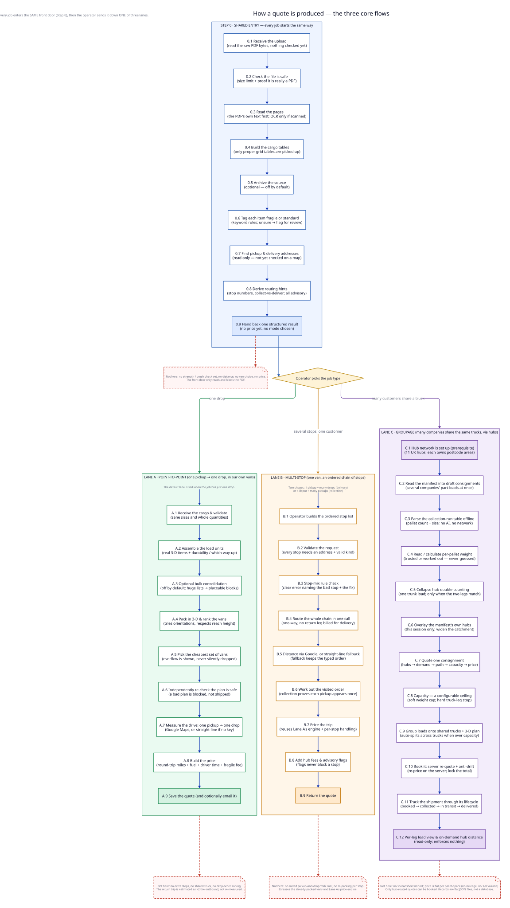

# FleetView — the core quote flows

A plain-language, micro-step map of the **three job types the system actually handles today**. Every step lists both what it *does* and, just as importantly, **what it does not do** — so nothing is assumed to exist that hasn't been built.

> Every claim below was read from the running source code and independently re-checked against it.

---

## Does every job really start the same way?

Almost. The main front door accepts **one thing: a quote PDF** — no images, no spreadsheets, no manual typing. That single PDF is read and labelled once (**Step 0**), and only *then* does the operator choose one of three lanes.

The one nuance: two of the lanes (multi-stop *collection* and *groupage*) can **also** be fed their own separate PDF, or in some cases typed input, instead of the Step 0 result.

So the honest answer: **a PDF is essentially always the first input — but not always the *same* Step 0 PDF.**

After Step 0, the operator picks **one** lane:

| Lane | Job type | In one line |
|------|----------|-------------|
| **A** | Point-to-point | one pickup → one drop, in our own vans |
| **B** | Multi-stop | one van, an ordered chain of stops (one customer) |
| **C** | Groupage | many companies share the same trucks, via hubs |

---

## Step 0 · Shared entry — every job starts here

*Turns one uploaded PDF into a clean, structured result. No price, no route, and no job type are decided here.*

**0.1 — Receive the upload**
- **Does:** takes the uploaded file over the web and reads its raw bytes.
- **Doesn't:** no checking of any kind yet — the front door is a thin hand-off; every safety check is deferred to the next step.

**0.2 — Check the file is safe**
- **Does:** rejects an empty file, anything over the size limit (~25 MB), anything that isn't a PDF by type, and — for PDFs — sniffs the opening bytes to confirm it's genuinely a PDF and not a renamed something-else. Fails loudly with a clear error.
- **Doesn't:** no virus/malware scan and no page-count limit. The "is it really this type" byte-check is wired for PDFs only.

**0.3 — Read the pages**
- **Does:** first reads the PDF's own embedded text layer (exact, free, instant). Only if a page comes back nearly empty (i.e. it's a scan/image) does it fall back to an OCR reader. Identical PDFs are remembered, so the same file is never read twice.
- **Doesn't:** the OCR fallback needs an API key that is empty by default — so out of the box a *scanned* PDF fails until a key is configured. Only true text-based PDFs work with no setup.

**0.4 — Build the cargo tables**
- **Does:** converts each page into a proper grid — header row plus item rows — that the rest of the system can work with. Marks the result "needs review" whenever it came from OCR rather than exact text.
- **Doesn't:** only recognises real grid tables. If a PDF lays its numbers out as free text or loose columns, nothing is captured. It also doesn't yet interpret which column means what (that mapping happens later, inside packing).

**0.5 — Archive the source (optional, off by default)**
- **Does:** if storage is switched on, quietly keeps a copy of the PDF and the structured result, keyed so a re-upload is recognised. Any failure here is swallowed so it can never block the quote.
- **Doesn't:** nothing at all unless storage is explicitly enabled — by default this step is a no-op.

**0.6 — Tag each item fragile or standard**
- **Does:** reads each cargo row's text and matches it against keyword rules: exact phrases first, then "fragile" words (fragile wins ties, deliberately cautious), then "standard" words. Anything it can't decide is flagged low-confidence for a human to check. Records why each decision was made.
- **Doesn't:** this is the *only* classification here. It does **not** work out durability, crush-strength, or which-way-up an item must travel — that is a separate step later, inside packing. It extracts no dimensions, weights or quantities. Keyword matching only — no AI understanding of meaning.

**0.7 — Find pickup & delivery addresses**
- **Does:** scans the document for a pickup address and one or more delivery addresses using label + UK-postcode patterns. Degrades gracefully — a weak read never crashes the flow.
- **Doesn't:** it *reads* addresses but does **not** confirm they exist or place them on a map (that happens later, only if needed). The optional smarter AI reader is off unless explicitly configured.

**0.8 — Derive routing hints**
- **Does:** a few gentle passes tag rows with a stop number if the sheet is a multi-drop manifest, guess collect-vs-deliver direction, and surface any hubs the sheet names for itself.
- **Doesn't:** every hint is advisory — the operator can override all of them, and nothing here commits the job to a mode or saves anything permanently.

**0.9 — Hand back one structured result**
- **Does:** returns a single tidy package: the tables, the fragile tags, the addresses, the hints — plus the thresholds the screen uses to *suggest* a job type. This is where the shared entry ends.
- **Doesn't:** no job type is chosen by the system, and no packing, distance or price is produced. The suggestion is just that — the operator decides the lane.

---

## Lane A · Point-to-point — one pickup → one drop, in our own vans

*The default lane, used when the job has a single drop. Cargo is packed into fleet vans, one drive is measured, and a price is built. Selected automatically when the job carries no extra stops.*

**A.1 — Receive the cargo & validate**
- **Does:** accepts the classified cargo (or, on an alternate entrance, a pre-made item list) and checks the shapes are sane — positive sizes, whole quantities.
- **Doesn't:** no addresses and no pricing here — this stage is purely about the physical goods.

**A.2 — Assemble the load units**
- **Does:** turns each cargo row into a real 3-D item with dimensions, weight and handling facts (including the durability / which-way-up check that Step 0 deliberately skipped). Tables it can't size are surfaced as "skipped" or "please verify", never silently dropped.
- **Doesn't:** it does not quietly ignore unreadable rows, and it assigns no delivery-stop order (there's only one drop).

**A.3 — Optional bulk consolidation**
- **Does:** for very large orders, identical items collapse into palletised blocks and loose oddments get boxed together, so a huge list becomes a manageable number of placeable blocks. Real counts are restored afterwards, guarded so nothing can go missing.
- **Doesn't:** off by default (items pass through untouched), and it never merges cargo across different jobs or customers — one order only.

**A.4 — Pack the cargo in 3-D & rank the vans**
- **Does:** places each item inside a van's interior, trying allowed orientations and respecting a safe reach height, then tries every van type to answer "which vans could carry this, and how tightly".
- **Doesn't:** no drop-order arrangement ("earliest drop nearest the doors") — that only exists in Lane B.

**A.5 — Pick the cheapest set of vans**
- **Does:** finds the lowest-cost *combination* of vans that carries the whole job — first flagging anything no van could ever take (too big/too heavy) with a plain reason, then minimising running cost (per-mile rate + a payload-adjusted fuel allowance). Ties prefer fewer, fuller vans.
- **Doesn't:** overflow is reported as unplaced with reasons, never dropped. The choice is made on rate, not live trip distance (distance is applied afterwards). No sharing a van with another customer.

**A.6 — Independently re-check the plan is safe**
- **Does:** every produced van layout is re-validated from scratch (overlaps, bounds, support, reach height) using the same rules as the 3-D editor. A bad plan is rejected loudly, naming the rule that failed.
- **Doesn't:** it only blocks a bad plan — it does not attempt to repair one, and it touches no pricing.

**A.7 — Measure the drive (one pickup → one drop)**
- **Does:** asks Google Maps for real driving distance and time for the single leg. With no map key it falls back to a straight-line estimate.
- **Doesn't:** no intermediate stops, and the return journey home is **not** separately measured — it's handled as a multiplier in pricing.

**A.8 — Build the price**
- **Does:** bills every van over the route: distance cost = miles × a return factor (default ×2, a full round trip back to base empty) × the van's per-mile rate; plus a payload-adjusted fuel line; plus one driver's time (drive time + a fixed load/unload allowance); plus a per-fragile-item surcharge; plus a CO₂ figure. Session settings can override these; anything unset uses config.
- **Doesn't:** the return leg is a flat ×2 of the outbound, not a separately-measured road home (asymmetric roads are deliberately ignored for fairness). No hub/cross-dock fee unless one is explicitly supplied. No cost-splitting across jobs — each van is billed the full route.

**A.9 — Save & optionally email the quote**
- **Does:** appends the quote to history (with optional customer info) and, on a separate explicit action, renders and emails it.
- **Doesn't:** emailing is never automatic — it's a deliberate second step.

> **Lane A does not have:** multi-stop routing · a shared/groupage truck · a separately-measured return leg · drop-order load zoning · a default hub cross-dock. Van choice is optimised on rate + fuel, not on live trip distance.

---

## Lane B · Multi-stop — one van, an ordered chain of stops

*One van (or the packed fleet) drives a single ordered chain as one full-load job. Two shapes exist: **delivery** = one pickup + many drops; **collection** = one depot + many pickups. Both run the same engine, told apart by which rule-set is injected.*

**B.1 — Operator builds the ordered stop list**
- **Does:** for delivery, the pickup plus the typed drop addresses (a pinned drop is forced to the end). For collection, a chosen hub plus a list of pickups (typed, or read from an uploaded pickup-manifest PDF).
- **Doesn't:** no true mixed pickup-and-drop "milk run" — it's exactly 1 pickup + N drops, *or* hub + N pickups. Interleaving the two is deliberately out of scope.

**B.2 — Validate the request**
- **Does:** rejects malformed input up front: every stop needs an address and a valid kind, the van list can't be empty, counts can't be negative; collection caps the pickups at 100.
- **Doesn't:** addresses aren't confirmed real/mappable here, and the delivery entrance won't accept a "hub" stop at all.

**B.3 — Stop-mix rule check (fail loud, but fixable)**
- **Does:** enforces the shape — delivery must start with the one pickup then 1…max drops; collection must start with the hub then only pickups. A violation throws a clear error naming the offending stop *and* the exact fix.
- **Doesn't:** the engine itself is deliberately rule-agnostic — the "must start with a pickup" logic lives only in the swapped-in rule-set, not baked into the core.

**B.4 — Route the whole chain in one call (one-way)**
- **Does:** builds the ordered waypoints (pickup → optional via-hub → drops → optional pinned final stop) and asks for the whole chain at once. Collection pins the hub again at the end so the van returns to depot. A zero-mile leg is a hard error, never a silent £0.
- **Doesn't:** no return leg is billed for delivery (the return factor is forced to 1, not ×2 like Lane A).

**B.5 — Distance via Google, or straight-line fallback**
- **Does:** with a map key: real driving distance/time and an optional cheapest visiting order. With no key: a straight-line estimate that sums the legs and adds a loud "this is an estimate, the real quote will be higher" warning.
- **Doesn't:** the straight-line fallback **cannot** re-order stops — it silently keeps the order as typed. Order optimisation is real only with Google Maps.

**B.6 — Work out the visited order**
- **Does:** translates the routing engine's chosen order back to the operator's own stop numbering so the screen can show the path taken. Collection additionally proves every pickup appears exactly once, or it errors.
- **Doesn't:** the delivery side does **not** run that exactly-once safety check — only collection does.

**B.7 — Price the trip (reuses Lane A's engine)**
- **Does:** uses the *same* pricing calculator as point-to-point — distance + driver time + fragile surcharge — but with an extra per-stop handling allowance multiplied by the number of stops. Delivery reuses the already-packed fleet; collection prices one empty van.
- **Doesn't:** there is no separate bespoke multi-stop pricer — it's Lane A's calculator with a return factor of 1 and inflated handling minutes. Collection carries no packed cargo, so no fuel line.

**B.8 — Add hub fees & advisory flags**
- **Does:** delivery — if routed via a hub, adds a flat cross-dock handling fee. Collection — marks each pickup in- or out-of the chosen hub's catchment and warns on any that fall outside.
- **Doesn't:** catchment flags are advisory surfaces, never gates — an out-of-area or unreadable pickup is flagged, never removed from the run.

**B.9 — Return the quote**
- **Does:** delivery returns the quote + warnings + visiting order and saves it to history. Collection returns the hub, the ordered pickups with verdicts, and the quote, and can show per-stop 3-D pallet cards by regrouping the existing packing.
- **Doesn't:** collection quotes are **not** written to history (only delivery saves). The per-stop cards do no new packing — they only regroup what the packer already produced.

> **Lane B does not have:** a mixed pickup-and-drop milk run · any re-packing per stop (it reuses the fleet packed in Lane A) · order optimisation without a Google key · an up-front address-validity check. One planning helper for splitting the load by drop-order exists in the code but is **not wired to anything** — unused scaffolding, not part of the running flow.

---

## Lane C · Groupage — many companies share the same trucks, via hubs

*Several companies' part-loads are read off one shared manifest, matched to regional hubs, grouped onto shared trucks by pallet-space and weight, priced from a rate card, then booked and tracked through delivery. Selected by using the groupage screens/endpoints rather than the standard packer.*

**C.1 — Hub network is set up (prerequisite)**
- **Does:** loads the regional network — 11 UK hubs, each owning a distinct set of postcode areas. Operators can add/edit/delete hubs (validated, and the areas must not overlap), or extract *candidate* hubs from a depot-list PDF.
- **Doesn't:** no spreadsheet import; the depot-PDF path only *suggests* hubs and never auto-writes the network. Catchment is exact postcode-area match — no fuzzy/geographic fallback.

**C.2 — Read the manifest into a roster of draft consignments**
- **Does:** turns one shared manifest into a list of companies, each with an origin, a destination and pallet lines. It can read a freshly-dropped PDF or reuse a document already read earlier in the flow (no re-reading). An unreadable document comes back as an empty list, never a crash.
- **Doesn't:** leaner than the main packer — no fragility tagging, no address detection. Nothing is saved yet; the roster is returned for the operator to confirm.

**C.3 — Parse the collection-run table offline**
- **Does:** the default reader parses the manifest's labelled grid (one row per company: name, address, pallet *count*, pallet size) with plain rules — no AI, no network — so a dead API key can't break it. It reads the authoritative pallet-count column and classifies each footprint (full / half / quarter / oversize). Reads across page breaks.
- **Doesn't:** a freeform manifest with no such table returns empty unless an optional AI fallback is configured. It never invents a company, and deliberately ignores the per-piece carton counts (avoiding a "10,000-carton" trap).

**C.4 — Read (or calculate) per-pallet weight — never estimate**
- **Does:** resolves weight in strict priority: (1) a dedicated weight column → taken as-is; else (2) calculated from the cargo-summary totals matched to the company, split across its pallets; else (3) left blank and flagged for the operator. An implausibly heavy calculated pallet is *kept but flagged* — never dropped or blocked.
- **Doesn't:** no density/volume guessing. If the manifest states no weight anywhere, weight stays blank and is surfaced, never invented. The document's own totals are trusted.

**C.5 — Collapse hub double-counting to one trunk load**
- **Does:** when a manifest describes collect → hub → trunk → deliver, the same pallets legitimately appear on both legs (≈ double). This step detects that pattern — and only when the two legs' pallet totals match — and collapses it to one consolidated trunk load carrying the pallets once.
- **Doesn't:** fail-safe — if the two legs don't match, it does **not** pick one; it leaves the roster unchanged. It won't guess the two hub postcodes if they're unreadable.

**C.6 — Overlay the manifest's own hubs for this session**
- **Does:** reads the hubs the document names for itself and layers them over the saved network for this request only, widening the collection hub's catchment to cover everywhere the run actually collects from — so out-of-area companies don't fall off the shared truck.
- **Doesn't:** a hub with no readable postcode is skipped, not guessed. These session hubs are never written to the permanent network.

**C.7 — Quote one consignment (hubs → demand → path → capacity → price)**
- **Does:** for a single consignment — resolve its end hubs, total its pallet-spaces and weight, build the door-to-door path (collect → trunk → deliver, or collect → deliver locally), check every leg against capacity, then price from a flat rate card: pallet-spaces × a per-space rate + first/last-mile surcharges + a heavy-pallet surcharge.
- **Doesn't:** **no mileage and no 3-D volume in the price** — it's a flat per-pallet-space lookup. The trunk is a single hop only (multi-hop is deferred). Delivery time is echoed from the input, never computed.

**C.8 — Capacity — a configurable ceiling**
- **Does:** two ceilings. The per-pallet weight ceiling is *soft* (off by default): the document's stated tonnage is trusted and priced, overflow surfaced not blocked. The per-truck-leg capacity (pallet-spaces *and* weight) is checked, and on the single-quote and booking paths it *does* hard-stop — but the error names the leg, the exact overflow, and how many vehicles the load actually needs. Every limit is a config value, editable without code.
- **Doesn't (important nuance):** the "capacity should never be a hard reject" principle is only **partly** honoured — the single-quote and booking checks *do* hard-stop on an over-capacity leg. The flexible "auto-split instead of reject" behaviour lives only in the shared-truck planner (next step). Capacity is per-vehicle, not a live per-date balance.

**C.9 — Group loads onto shared trucks + 3-D plan**
- **Does:** groups consignments that share a leg onto the same truck. An over-capacity group is **auto-split** across the fewest feasible trucks (bin-packing on both space and weight), keeping each company's pallets together. Each truck's real geometry is loaded and pallets are auto-packed into an adjustable 3-D layout.
- **Doesn't:** here it never hard-rejects — a single load too big for any one truck stays on its own truck, *flagged*, never dropped. Grouping is quote-level only (not saved).

**C.10 — Book it (server re-quote + anti-drift)**
- **Does:** on booking, the server re-prices from the same inputs (never trusts a price sent from the screen); if the total has drifted by even a penny it refuses and reports the change. On agreement it creates a booked shipment and, in one locked step, re-checks capacity across this booking *plus* every other active shipment — catching two bookings that each fit alone but overflow the shared truck together.
- **Doesn't:** only hub-routed quotes can be booked — a direct (hubless) quote is quotable but not bookable. There's no dated reservation/hold ledger — booking records a shipment, it doesn't reserve a date's capacity.

**C.11 — Track the shipment through its lifecycle**
- **Does:** each shipment walks a guarded set of stages — booked → collected → at origin depot → in transit → at destination hub → out for delivery → complete — plus exception branches (roll to next truck, failed delivery + limited re-attempts, return to sender, cancel-before-collect). Illegal jumps are refused; every step is logged; writes are serialised so simultaneous updates can't clash.
- **Doesn't:** no physical barcode/scanner hardware — a "scan" is a status update via the system. Dated capacity holds are deferred.

**C.12 — Per-leg load view & on-demand hub distance**
- **Does:** a read-only view shows every active shipment grouped by the leg it travels, with space/weight used against each leg's capacity (e.g. "18/26 spaces"). Separately, a real road-distance lookup to a hub is available on explicit request (e.g. from a dragged map pin).
- **Doesn't:** the load view enforces nothing (capacity is enforced at booking). The nearest-hub straight-line helper is a map suggestion only — it is **not** the routing rule, which is exact catchment match.

> **Lane C does not have:** any spreadsheet import · a dated timetable / capacity-hold ledger · multi-hop trunking (single hop only) · any mileage or 3-D-volume component in the price (flat rate card; the configured zone-rate map is currently empty, so every lane prices at the flat default). Only hub-routed quotes are bookable. Records live in flat JSON files, not a real database.

---

## Truths that hold across all three lanes

- **One front door, three exits.** Step 0 is identical for everyone; the lanes diverge only *after* the PDF is read and the operator chooses.
- **The system suggests, the operator decides.** The job type is never forced by the software — Step 0 only ships thresholds that *recommend* a lane.
- **"Never guess" is enforced, not aspirational.** Low-confidence classifications, unreadable tables, out-of-area pickups and doubtful weights are all *flagged and surfaced*, never silently dropped or invented.
- **Default engines are the offline "rule" ones.** Fragility, address reading and the groupage manifest reader all default to plain rule-based logic with no external API — so a missing/expired key degrades quality, it doesn't take the system down.
- **Pricing differs fundamentally by lane.** Lanes A and B price on *distance* (per-mile van rates); Lane C prices on *pallet-space* (a flat rate card, no mileage). They are not the same money model.
- **Persistence is lightweight.** Quotes, hubs and shipments are stored in flat JSON files behind a single write-queue — correct for one running instance, not a multi-server database.

---

## The whole picture on one page

*Diagram source: `core-flows.d2` — regenerate with* `d2 --layout elk --theme 0 --pad 40 core-flows.d2 core-flows.svg`. *Every box maps to a step above; red dashed boxes list what each lane deliberately does **not** do. A companion print-ready PDF (`core-flows.pdf`) carries this same content.*
