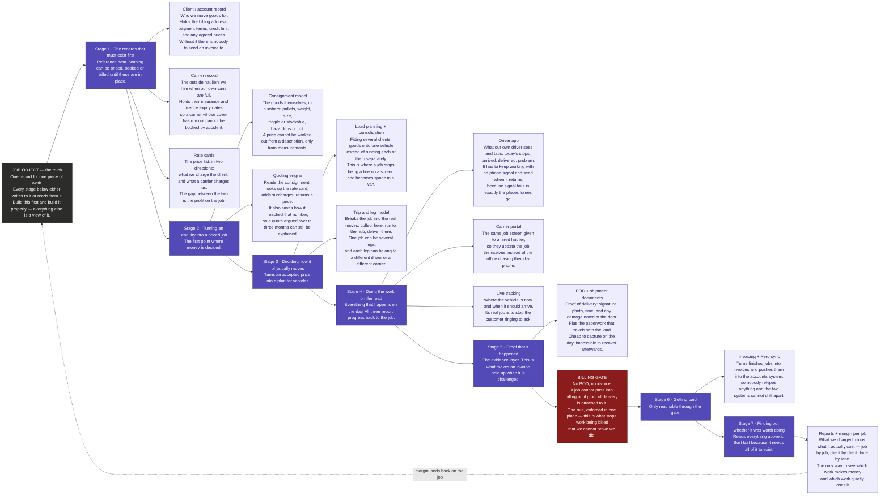
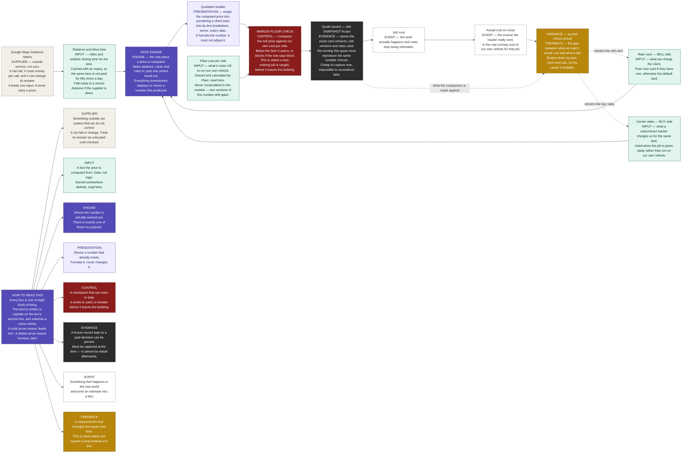

# Diagrams

Conventions for every PBS in this file:

- Each level-1 area carries a one-line subtitle saying **what kind of thing it is**, not what it does.
- Where a group of features collapsed into one mechanism, the subtitle says so. That reasoning is the point of the decomposition, so it sits at the top of the box, not in a footnote.
- Numbers live in the written PBS so branches can be referenced in conversation. The diagrams drop them so the boxes read as names.
- Diagrams go to level 3. Build items live in the written PBS — all four levels on one board is unreadable.
- Cross-module edges go in prose under the diagram, never as a leaf inside it.
- Diagrams run **left to right** (`graph LR`), not top-down. A tree this wide drawn top-down is 33,000 pixels across and 750 tall; every renderer scales it to fit the width, so it arrives as an 18-pixel smear. Left to right, the same tree is 1,516 wide and 16,060 tall — it scrolls down the page like a normal document and stays readable. Levels read left to right; adding items grows the page downward.

---

# Rates Management

**Ordering axis: dependency.** Nothing prices until a shipment is reduced to facts; no surcharge applies until there is a base price; no quote is defensible until rates are versioned. The cross-cutting layer sits underneath all six, not after them.

## Written PBS

### 1.0 Rate facts
*What a shipment is, in numbers. Nothing else can price without this.*

**1.1 Lane resolution**
- 1.1.1 Geography model
  - Postcode to zone mapping table
  - Zone-pair lane key — what a rate row is actually keyed on
  - Cross-border and country lane keys
  - Unmapped postcode reject log — a postcode nobody zoned must fail loudly, never price at zero
- 1.1.2 Distance and drive time
  - Map provider behind a swap seam — change provider without touching pricing
  - Traffic profile by departure band
  - Cached results with expiry — the same lane priced fifty times a day is not fifty paid calls
  - Offline fallback distance when the provider is down

**1.2 Cargo measures**
- 1.2.1 Chargeable quantity
  - Gross weight and chargeable weight
  - Volume and volumetric conversion factor
  - Pallet count by type to pallet spaces
  - Loading metres
  - Which basis wins when several apply — greater of weight or volume
- 1.2.2 Handling attributes
  - ADR class and hazard flags
  - Temperature band and fragility
  - Vehicle class required — feeds the fleet suitability rules, not a second copy of them

**1.3 Run shape**
- 1.3.1 Stop profile
  - Number of stops on the run
  - Handling minutes per stop
  - Waiting time per stop, captured in the driver app
- 1.3.2 Timing
  - Collection and delivery windows
  - Out-of-hours, weekend and bank holiday classification from a calendar config

---

### 2.0 Rate card engine
*First collapsed engine. Default card, customer card and carrier card are one record with a different owner. Building three is how this module triples in size.*

**2.1 Card model**
- 2.1.1 Card header
  - Owner — default, customer, carrier or subcontractor
  - Currency, effective from and to
  - Contract or spot flag
  - Notice period before a change can take effect — contractual, not technical
- 2.1.2 Rate rows
  - Lane key
  - Basis — per km, pallet, kg, hour or flat
  - Break bands — weight, pallet and distance brackets
  - Vehicle class band
  - Minimum charge per job

**2.2 Lookup**
- 2.2.1 Resolution order
  - Precedence — customer card, then default card, then unpriced
  - Most specific lane wins
  - Break-band selection, and which side of a boundary falls in which band
  - Unpriced is a result with a reason, never a silent zero
- 2.2.2 Adjustments
  - Override rate that beats the card
  - Discount percent on a card or a single lane
  - Spot quote capture — a one-off agreed price stored as its own row
- 2.2.3 Volume commitments
  - Tiered rates by committed annual volume
  - Retrospective rebate accrual — money owed back, provisioned monthly not discovered in January
  - Shortfall handling when the commitment is missed

**2.3 Buy side**
- 2.3.1 Carrier cards
  - Subcontractor agreed rates on the same card model
  - Lane cost estimate where no carrier card exists
- 2.3.2 Own-fleet cost input
  - Cost per mile read from the fleet cost ledger — consumed here, never calculated here
  - Live margin floor by vehicle class and lane
  - Stale-floor warning when the feed has not refreshed

**2.4 Money handling**
- 2.4.1 Currency and tax
  - Currency per card
  - FX rate-of-the-day snapshot
  - Rounding rules, per line or per total
  - VAT and reverse-charge treatment by lane

---

### 3.0 Charge rules
*Second collapsed engine. Every surcharge is a condition plus a formula. Twelve surcharges is one engine and twelve rows.*

**3.1 Rule engine core**
- 3.1.1 Rule shape
  - Trigger condition read off the rate facts
  - Formula — flat, per unit or percent of linehaul
  - Free allowance before it bites — thirty minutes free waiting
  - Cap and floor per rule
  - Stacking order and mutual exclusion — which surcharges may apply together
- 3.1.2 Explainability
  - Every applied line names the rule that fired
  - Rules that nearly fired, on request — "waiting was 28 minutes, allowance is 30"
- 3.1.3 Versioning and dry run
  - Rule versions with effective dates
  - Replay against past quotes before going live — what a new rule would have charged

**3.2 Rule catalogue** *(rows in the engine, not separate features)*
- 3.2.1 Index-linked
  - Fuel surcharge percent from a published index
  - Index ingestion with effective month
  - Recalculation when a new index lands
- 3.2.2 Time and access
  - Out-of-hours, weekend, bank holiday
  - Waiting beyond the free period
  - Failed delivery and redelivery
- 3.2.3 Equipment and goods
  - Tail-lift, moffett, crane
  - ADR handling
- 3.2.4 Route costs
  - Congestion charges and tolls
  - Ferries
  - Return leg and empty running — distance run with nothing in the back

---

### 4.0 Pricing run
*The number, and the evidence that defends it six months later.*

**4.1 Quote assembly**
- 4.1.1 Calculation
  - Linehaul from the card lookup
  - Surcharge lines from the rule engine
  - Line-by-line breakdown in customer language
  - Unpriceable result with reason codes — which fact or which card was missing
- 4.1.2 Validity
  - Quote expiry date, enforced rather than decorative
  - Re-price on expiry against current rates

**4.2 Margin**
- 4.2.1 Buy versus sell
  - Cost side from the carrier card or the fleet floor
  - Margin in pounds and percent at the moment of quoting
  - Below-floor blocked or warned, per the approval rules

**4.3 Freezing**
- 4.3.1 Snapshot
  - Rates and rule versions frozen into the quote — a reprice must reproduce it exactly
  - Mid-shipment rate change reconciliation — which price wins, and why
  - Re-quote stored as a new version, the old one kept

**4.4 Closing the loop**
- 4.4.1 Quoted versus actual
  - Actual cost posted back from the fleet cost ledger per job
  - Variance by lane, customer and rule
  - Recalibration recommended, human accepts or overrides, outcome recorded

---

### 5.0 Governance
*Effective dating, audit, approval. The branch that cannot be retrofitted — a rate overwritten once is gone.*

**5.1 Versioning**
- 5.1.1 Effective dating
  - Rows never overwritten
  - Superseded rows archived, not deleted
  - Future-dated activation
  - Expiry warnings before a card lapses

**5.2 Audit**
- 5.2.1 Change log
  - Who changed what and when, old value to new value
  - Reason or reference on every change
  - Append-only, separately queryable from business data

**5.3 Approvals**
- 5.3.1 Discount control
  - Approval required above a configured percent
  - Approver roles and delegation
  - Pending, approved, rejected states
  - Freeze a card from further use without deleting it

---

### 6.0 Operator tools
*Where a transport manager works, and where a wrong rate is caught before a customer finds it.*

**6.1 Lookup and test**
- 6.1.1 Rate test tool
  - Price a test shipment and see every rule that fired
  - Explain trace — which card, which row, which band
  - Compare two cards side by side

**6.2 Bulk data**
- 6.2.1 Import
  - CSV and Excel import with column mapping
  - Dry-run validation report before anything commits
  - Rejection log with reason codes for partial imports
  - Duplicate-lane detection within the same file

**6.3 Coverage and simulation**
- 6.3.1 Reports
  - Coverage gaps — lanes being quoted with no rate behind them
  - Rate expiry dashboard
- 6.3.2 What-if
  - Simulate a price change across past volume
  - Margin impact by customer

---

### 7.0 Cross-cutting layer
*Sits underneath all six, not after them. Retrofitting any of these is expensive.*

**7.1 Identity and permissions**
- 7.1.1 Who sees cost
  - Roles — sales, planner, finance, owner
  - Buy rates and margin hidden from sales roles by default — the most sensitive field in the module
  - Customer-scoped visibility for portal users

**7.2 Alerting and escalation**
- 7.2.1 Delivery rules
  - Channel and recipient per alert type
  - Escalation when an expiry notice goes unacknowledged
  - Deduplication — one lapsing card must not send forty emails

**7.3 Configuration**
- 7.3.1 Per-company settings
  - Rounding, units, currency, working week and calendar
  - Discount thresholds and approval limits

**7.4 Integrations and API**
- 7.4.1 Inbound and outbound
  - Fuel index feed in, FX feed in
  - Fleet cost ledger in
  - Quote and invoice lines out to accounting
  - Rate lookup API for a customer portal

---

## Diagram — Rates Management

Rendered copy: [pbs-rates.svg](../../pbs-rates.svg) — in the project root, opens in a browser, drags into Figma as editable shapes.

```mermaid
graph LR

R["Rates management"]

R --> P1["Rate facts<br/>what a shipment is, in numbers"]
R --> P2["Rate card engine<br/>one card, three owners"]
R --> P3["Charge rules<br/>condition plus formula"]
R --> P4["Pricing run<br/>the number and its evidence"]
R --> P5["Governance<br/>cannot be retrofitted"]
R --> P6["Operator tools<br/>catch it before the customer does"]
R --> P7["Cross-cutting<br/>underneath everything"]

P1 --> P1A["Lane resolution"]
P1A --> P1A1["Geography model<br/>zones, lane keys, unmapped reject log"]
P1A --> P1A2["Distance and drive time<br/>provider seam, traffic, cache, fallback"]
P1 --> P1B["Cargo measures"]
P1B --> P1B1["Chargeable quantity<br/>weight, volume, pallets, which basis wins"]
P1B --> P1B2["Handling attributes<br/>ADR, temperature, vehicle class needed"]
P1 --> P1C["Run shape"]
P1C --> P1C1["Stop profile<br/>stop count, handling and waiting minutes"]
P1C --> P1C2["Timing<br/>windows, out-of-hours calendar"]

P2 --> P2A["Card model"]
P2A --> P2A1["Card header<br/>owner, currency, effective dates, notice"]
P2A --> P2A2["Rate rows<br/>lane, basis, breaks, vehicle band, minimum"]
P2 --> P2B["Lookup"]
P2B --> P2B1["Resolution order<br/>customer then default, unpriced has a reason"]
P2B --> P2B2["Adjustments<br/>override, discount, spot capture"]
P2B --> P2B3["Volume commitments<br/>tiers, rebate accrual, shortfall"]
P2 --> P2C["Buy side"]
P2C --> P2C1["Carrier cards<br/>subcontractor rates, lane cost estimate"]
P2C --> P2C2["Own-fleet cost input<br/>read from the fleet ledger, not calculated"]
P2 --> P2D["Money handling"]
P2D --> P2D1["Currency and tax<br/>FX snapshot, rounding, VAT treatment"]

P3 --> P3A["Rule engine core"]
P3A --> P3A1["Rule shape<br/>trigger, formula, allowance, cap, stacking"]
P3A --> P3A2["Explainability<br/>every line names the rule that fired"]
P3A --> P3A3["Versioning and dry run<br/>replay a new rule against past quotes"]
P3 --> P3B["Rule catalogue"]
P3B --> P3B1["Index-linked<br/>fuel percent, index ingest, recalc"]
P3B --> P3B2["Time and access<br/>out-of-hours, waiting, failed delivery"]
P3B --> P3B3["Equipment and goods<br/>tail-lift, moffett, crane, ADR"]
P3B --> P3B4["Route costs<br/>tolls, ferries, empty running"]

P4 --> P4A["Quote assembly"]
P4A --> P4A1["Calculation<br/>linehaul, surcharges, breakdown, reason codes"]
P4A --> P4A2["Validity<br/>quote expiry enforced, re-price on lapse"]
P4 --> P4B["Margin"]
P4B --> P4B1["Buy versus sell<br/>margin at quote, below-floor block or warn"]
P4 --> P4C["Freezing"]
P4C --> P4C1["Snapshot<br/>rates and rules frozen, reprice reproduces it"]
P4 --> P4D["Closing the loop"]
P4D --> P4D1["Quoted versus actual<br/>variance by lane, customer and rule"]

P5 --> P5A["Versioning"]
P5A --> P5A1["Effective dating<br/>never overwrite, archive, future-date, expiry"]
P5 --> P5B["Audit"]
P5B --> P5B1["Change log<br/>who, what, when, before and after"]
P5 --> P5C["Approvals"]
P5C --> P5C1["Discount control<br/>threshold, approver, states, freeze switch"]

P6 --> P6A["Lookup and test"]
P6A --> P6A1["Rate test tool<br/>price a shipment, explain trace, compare cards"]
P6 --> P6B["Bulk data"]
P6B --> P6B1["Import<br/>mapping, dry run, rejection log, duplicates"]
P6 --> P6C["Coverage and simulation"]
P6C --> P6C1["Reports<br/>coverage gaps, expiry dashboard"]
P6C --> P6C2["What-if<br/>price change on past volume, margin by customer"]

P7 --> P7A["Identity and permissions<br/>buy rates hidden from sales by default"]
P7 --> P7B["Alerting and escalation<br/>channel, escalation, dedupe"]
P7 --> P7C["Configuration<br/>rounding, units, calendar, approval limits"]
P7 --> P7D["Integrations and API<br/>index and FX in, invoice lines out"]

classDef root fill:#2C2C2A,stroke:#2C2C2A,color:#FFFFFF
classDef prod fill:#EEEDFE,stroke:#534AB7,color:#26215C
classDef sub fill:#E1F5EE,stroke:#0F6E56,color:#04342C
classDef comp fill:#F1EFE8,stroke:#888780,color:#2C2C2A

class R root
class P1,P2,P3,P4,P5,P6,P7 prod
class P1A,P1B,P1C,P2A,P2B,P2C,P2D,P3A,P3B,P4A,P4B,P4C,P4D,P5A,P5B,P5C,P6A,P6B,P6C,P7A,P7B,P7C,P7D sub
class P1A1,P1A2,P1B1,P1B2,P1C1,P1C2,P2A1,P2A2,P2B1,P2B2,P2B3,P2C1,P2C2,P2D1,P3A1,P3A2,P3A3,P3B1,P3B2,P3B3,P3B4,P4A1,P4A2,P4B1,P4C1,P4D1,P5A1,P5B1,P5C1,P6A1,P6B1,P6C1,P6C2 comp
```

### Edges that matter — Rates

- **Margin at quote is a lookup, not a second pricing system.** Buy-side and sell-side sharing one card model (2.1) is the only reason 4.2 is cheap. Split them and cost gets priced twice, by two engines that drift.
- **5.1 and 5.2 must start on day one.** An audit trail cannot be back-dated and an overwritten rate cannot be reconstructed. 4.3's snapshot is worthless if cards were ever edited in place — that pairing *is* the legal defensibility of a quote.
- **6.3 What-if reads 5.1's archive.** Simulation is impossible until versioned history exists, so it is genuinely last rather than merely low priority.

---

# Fleet Management

Written PBS lives with the source document — this file carries the diagram. Paste the text in above the diagram when you want the two side by side.

## Diagram — Fleet Management

Rendered copy: [pbs-fleet.svg](../../pbs-fleet.svg)

```mermaid
graph LR

F["Fleet management"]

F --> P1["Resource register<br/>what exists"]
F --> P2["Telemetry and event capture<br/>what happened, when"]
F --> P3["Status and time ledger<br/>what state, from when to when"]
F --> P4["Compliance and obligations<br/>legal right to move"]
F --> P5["Suitability and allocation<br/>who takes this job"]
F --> P6["Condition and maintenance<br/>keeping metal legal"]
F --> P7["Cost and performance<br/>what it costs to run"]
F --> P8["Cross-cutting<br/>underneath everything"]

P1 --> P1A["Vehicle record"]
P1A --> P1A1["Identity<br/>reg, VIN, class, ownership, depot"]
P1A --> P1A2["Physical envelope<br/>internal dimensions, payload, fitments"]
P1A --> P1A3["Configuration history<br/>spec changes with effective dates"]
P1 --> P1B["Trailer and equipment record"]
P1B --> P1B1["Towed and detachable assets<br/>own envelope, coupling fit"]
P1 --> P1C["Driver record"]
P1C --> P1C1["Identity and employment<br/>employed, agency, owner-driver"]
P1C --> P1C2["Entitlements<br/>licence, tacho card, CPC, medical"]
P1C --> P1C3["Capability tags<br/>tail-lift, HIAB, FLT, inductions"]
P1 --> P1D["Site and depot record"]
P1D --> P1D1["Places the fleet stops<br/>geofence polygon, access limits"]
P1 --> P1E["Register mechanics"]
P1E --> P1E1["Typed resource model<br/>one register, many types"]
P1E --> P1E2["Effective-dated attributes<br/>as-at queries"]
P1E --> P1E3["Archive not delete<br/>sold assets stay readable"]

P2 --> P2A["Position sources"]
P2A --> P2A1["Read-only telematics connectors<br/>Samsara, Geotab, Webfleet, Quartix"]
P2A --> P2A2["Driver phone fallback<br/>background GPS from the app"]
P2A --> P2A3["Source precedence<br/>which wins, last known on drop"]
P2 --> P2B["Ingest pipeline"]
P2B --> P2B1["Normalise and store<br/>one internal ping shape"]
P2B --> P2B2["Frequency and retention<br/>rate, window, downsample"]
P2B --> P2B3["Offline queue and backfill<br/>replay on reconnect"]
P2 --> P2C["Derived events"]
P2C --> P2C1["Geofence arrive and depart<br/>computed, recomputable"]
P2C --> P2C2["Stop, dwell and movement class<br/>moving, idling, stopped"]
P2 --> P2D["Non-position events"]
P2D --> P2D1["Other timestamped facts<br/>fuel, tolls, weighbridge, PODs"]
P2 --> P2E["Journey replay"]
P2E --> P2E1["Historical trace per job<br/>exportable evidence pack"]

P3 --> P3A["Vehicle status ledger"]
P3A --> P3A1["State timeline per asset<br/>available, on job, workshop, VOR"]
P3 --> P3B["Driver time ledger"]
P3B --> P3B1["Clock and break capture<br/>app or tacho"]
P3B --> P3B2["Hours compliance<br/>drivers hours, WTD, hours left today"]
P3B --> P3B3["Planned availability<br/>rota, holiday, sickness"]
P3 --> P3C["Assignment ledger"]
P3C --> P3C1["Who had what, when<br/>the record that stops double-booking"]
P3 --> P3D["Derived measures"]
P3D --> P3D1["Rollups, not features<br/>utilisation, VOR days, empty running"]
P3 --> P3E["Ledger mechanics"]
P3E --> P3E1["Correctness rules<br/>append-only, corrections, time zones"]

P4 --> P4A["Obligation engine core"]
P4A --> P4A1["Obligation model<br/>subject, type, due, evidence, owner"]
P4A --> P4A2["Dual clock<br/>date and mileage triggers"]
P4A --> P4A3["Reminder ladder<br/>90, 30, 7, day-of, overdue"]
P4A --> P4A4["Evidence capture<br/>closed by a document, not a tickbox"]
P4 --> P4B["Regulatory coverage"]
P4B --> P4B1["Vehicle obligations<br/>test, VED, insurance, tacho, zones"]
P4B --> P4B2["Operator obligations<br/>O-licence discs and margin"]
P4B --> P4B3["Driver obligations<br/>DVLA check, CPC, medical, ADR"]
P4 --> P4C["Enforcement"]
P4C --> P4C1["Veto interface<br/>allocation cannot commit without it"]
P4C --> P4C2["Override path<br/>named approver, reason, time-boxed"]
P4 --> P4D["Audit and inspection"]
P4D --> P4D1["Evidence pack export<br/>point-in-time reconstruction"]

P5 --> P5A["Rules engine core"]
P5A --> P5A1["Evaluation model<br/>allow, warn or block"]
P5A --> P5A2["Rule authoring<br/>no-code, transport manager writes it"]
P5A --> P5A3["Explainability<br/>every block names the rule"]
P5A --> P5A4["Versioning and dry run<br/>replay against past jobs"]
P5 --> P5B["Rule sets"]
P5B --> P5B1["Vehicle to job<br/>payload, dimensions, temp, access"]
P5B --> P5B2["Driver to vehicle<br/>licence category, trained-on tags"]
P5B --> P5B3["Driver to job<br/>hours left, ADR, inductions"]
P5B --> P5B4["Slot to dock or bay<br/>reused by warehouse later"]
P5 --> P5C["Allocation"]
P5C --> P5C1["Candidate ranking<br/>cost, empty miles, utilisation"]
P5C --> P5C2["Commit and lock<br/>concurrent planner conflicts"]
P5C --> P5C3["Disruption and reassignment<br/>cascade replan, notify"]
P5C --> P5C4["Subcontract fallback<br/>no legal option triggers carrier"]

P6 --> P6A["Defect flow"]
P6A --> P6A1["Daily walkaround check<br/>mandatory, photo evidence, nil-defect"]
P6A --> P6A2["Raise to rectify<br/>triage, repair, competent sign-off"]
P6A --> P6A3["Auto-VOR<br/>safety defect makes it un-assignable"]
P6 --> P6B["Planned maintenance"]
P6B --> P6B1["Service schedules<br/>raised as obligations, not separately"]
P6B --> P6B2["Workshop capacity<br/>downtime visible to allocation early"]
P6 --> P6C["Work orders and parts"]
P6C --> P6C1["Job cards<br/>labour, parts, warranty, cost posting"]
P6 --> P6D["Lifecycle"]
P6D --> P6D1["Whole-life view<br/>tyres, replacement point, lease end"]

P7 --> P7A["Cost ledger"]
P7A --> P7A1["Typed cost entries<br/>running, standing, people"]
P7A --> P7A2["Shared cost allocation<br/>spread, not spiked on payment day"]
P7A --> P7A3["Automated capture<br/>fuel card matched to odometer"]
P7 --> P7B["Activity base"]
P7B --> P7B1["Denominators<br/>miles from telemetry, hours from ledger"]
P7 --> P7C["Derived metrics"]
P7C --> P7C1["Per asset<br/>cost per mile, MPG, lifetime maintenance"]
P7C --> P7C2["Per work<br/>cost per job, lane, customer"]
P7 --> P7D["Feedback loop"]
P7D --> P7D1["Margin floor feed<br/>publishes into the quoting rate engine"]
P7D --> P7D2["Variance ledger<br/>quoted versus actual, every job"]
P7D --> P7D3["Recalibration<br/>recommend, human accepts, record outcome"]
P7 --> P7E["Drift alerting"]
P7E --> P7E1["Asset baselines<br/>each vehicle against its own history"]

P8 --> P8A["Identity and permissions<br/>roles, depot scope, driver sees own"]
P8 --> P8B["Alerting and escalation<br/>quiet hours, escalation, dedupe"]
P8 --> P8C["Configuration<br/>obligation types, cost categories, units"]
P8 --> P8D["Audit trail<br/>who changed what, before and after"]
P8 --> P8E["Integrations and API<br/>telematics in, accounting out, webhooks"]
P8 --> P8F["Data retention and privacy<br/>driver location is personal data"]
P8 --> P8G["Mobile and offline<br/>no signal, sync conflicts, gloves"]

classDef root fill:#2C2C2A,stroke:#2C2C2A,color:#FFFFFF
classDef prod fill:#EEEDFE,stroke:#534AB7,color:#26215C
classDef sub fill:#E1F5EE,stroke:#0F6E56,color:#04342C
classDef comp fill:#F1EFE8,stroke:#888780,color:#2C2C2A

class F root
class P1,P2,P3,P4,P5,P6,P7,P8 prod
class P1A,P1B,P1C,P1D,P1E,P2A,P2B,P2C,P2D,P2E,P3A,P3B,P3C,P3D,P3E,P4A,P4B,P4C,P4D,P5A,P5B,P5C,P6A,P6B,P6C,P6D,P7A,P7B,P7C,P7D,P7E,P8A,P8B,P8C,P8D,P8E,P8F,P8G sub
class P1A1,P1A2,P1A3,P1B1,P1C1,P1C2,P1C3,P1D1,P1E1,P1E2,P1E3,P2A1,P2A2,P2A3,P2B1,P2B2,P2B3,P2C1,P2C2,P2D1,P2E1,P3A1,P3B1,P3B2,P3B3,P3C1,P3D1,P3E1,P4A1,P4A2,P4A3,P4A4,P4B1,P4B2,P4B3,P4C1,P4C2,P4D1,P5A1,P5A2,P5A3,P5A4,P5B1,P5B2,P5B3,P5B4,P5C1,P5C2,P5C3,P5C4,P6A1,P6A2,P6A3,P6B1,P6B2,P6C1,P6D1,P7A1,P7A2,P7A3,P7B1,P7C1,P7C2,P7D1,P7D2,P7D3,P7E1 comp
```

---

# Edges between the two modules

These are the joins neither document can see on its own. Each one is a place where the same mechanism would otherwise get built twice.

- **Fleet publishes the cost floor; Rates consumes it.** Fleet `Cost and performance → Feedback loop → Margin floor feed` produces cost per mile by vehicle class. Rates `Rate card engine → Buy side → Own-fleet cost input` reads it. Rates must never compute its own fleet cost — two engines calculating the same number is how quoting and reality drift apart with nobody noticing which is wrong.
- **Rates freezes the quote; Fleet grades it.** Fleet's variance ledger compares quoted against actual per job. That comparison only exists if Rates `Pricing run → Freezing → Snapshot` preserved what was quoted and under which rule versions. Kill the snapshot and the entire feedback loop in both modules dies with it.
- **Vehicle class is decided once, in Fleet.** Rates `Cargo measures → Handling attributes` records what the load *needs*; Fleet `Suitability and allocation → Rule sets` decides what can *do* it. If Rates starts matching vehicles to jobs, there are two suitability engines and the quote will promise a van compliance would refuse.
- **Both have an alerting layer, and it should be one.** Rate-card expiry and MOT expiry are the same shape: a dated obligation, a reminder ladder, an escalation when unacknowledged, deduplication so one lapse does not send forty messages. Fleet's obligation engine already generalises this. Rates expiry warnings should be rows in it, not a second reminder system.

---

# Build order — the whole platform, in the order it can be built

Rendered copy: [pbs-build-order.svg](../../pbs-build-order.svg)

This is a different kind of map from the two above. The PBS diagrams answer *what is this made of*. This one answers *what has to exist before what*, so it doubles as the build sequence.

Read it left to right. Nothing on the right can be built until the thing feeding it exists. The **Job object** is the trunk — the only box that touches both ends, because every stage writes to it on the way out and the final margin report reads it on the way back.

## What this map is really saying

- **The gate is the whole design.** Everything from Stage 1 to Stage 5 exists to make one moment possible: putting proof next to a price. Build invoicing before the POD layer and you have built a way to send arguments.
- **Stages 1 and 2 are cheap to get wrong and expensive to fix.** The job record and the consignment record are what every later screen reads. Every field missing from them at the start becomes a migration later.
- **Stage 4 is three ways of doing one thing** — telling the office where the job has got to. Own driver, hired carrier, and the map are three faces of the same status update. Build one status mechanism and give it three front doors, not three mechanisms.
- **Stage 7 is not a reporting feature, it is the feedback loop.** Margin per job is what tells the quoting engine in Stage 2 that its prices are wrong. Without it the system runs forever without learning anything.
 

---

# Pricing loop — how a price is worked out, and how it corrects itself

Rendered copy: [pbs-pricing-loop.svg](../../pbs-pricing-loop.svg)

Different question from the build-order map. That one says *what must exist before what*. This one says *how a price is computed at run time, and how the system finds out it was wrong*. It is a loop, not a sequence — the variance at the end changes the cards at the start.

Scope rule that keeps the two from overlapping: this diagram never mentions anything outside pricing, and the build-order map never opens a capability box. They touch at two named points only — fleet cost per mile sets the floor, and the quote snapshot is what variance compares against.

