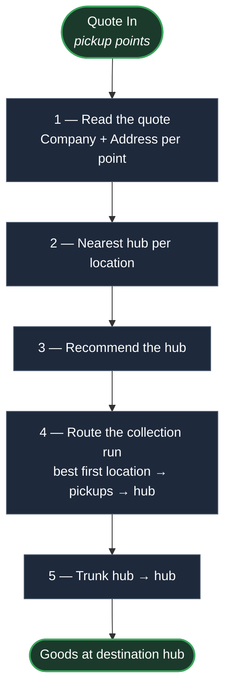

# Groupage (Shared Truck) — Core Flow

The core logic only. Edge cases (timetables, capacity, retries) are out of scope here.

> The text is the source of truth. The diagram is a picture of it — if they disagree, the text wins.

## Input

A **quote** = a list of **pickup points**. Each pickup point carries:

* **Company** — who the goods are collected from.
* **Address** — where that company is.

Both are required: the truck must know who to collect from and where to drive.

## Flow

1. **Read the quote** — take in the pickup points, each tagged with its company and address.
2. **Nearest hub per location** — map every pickup location to its closest hub.
3. **Recommend the hub** — choose the nearest hub serving these locations as the collection hub.
4. **Route the collection run** — the van starts at the most optimal first location, visits the other pickups, and ends at the hub.
5. **Trunk hub → hub** — long-haul from the collection hub to the other (destination) hub.

## Diagram

