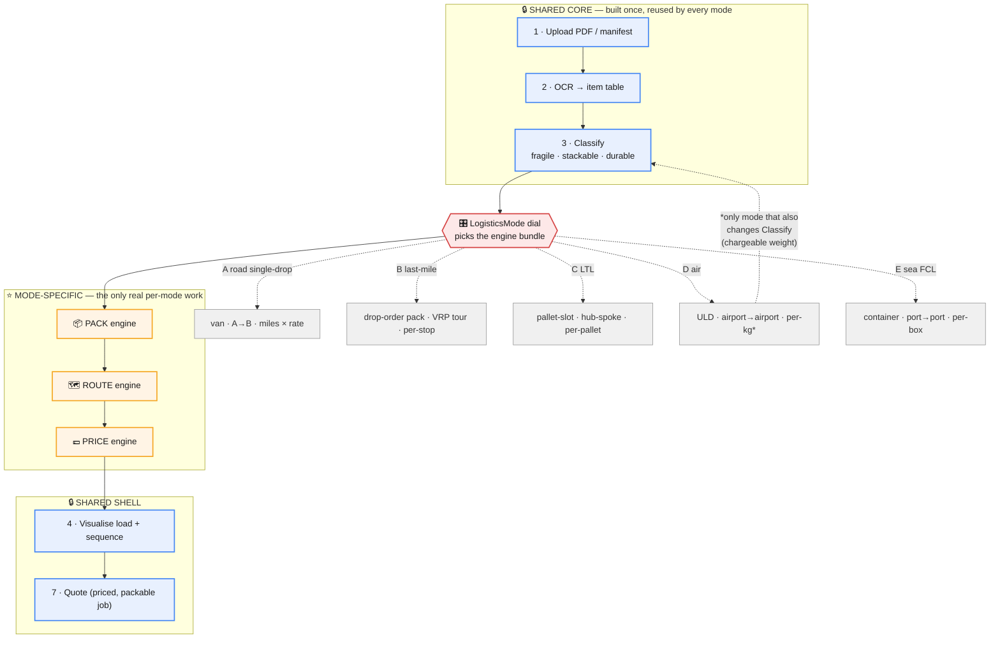
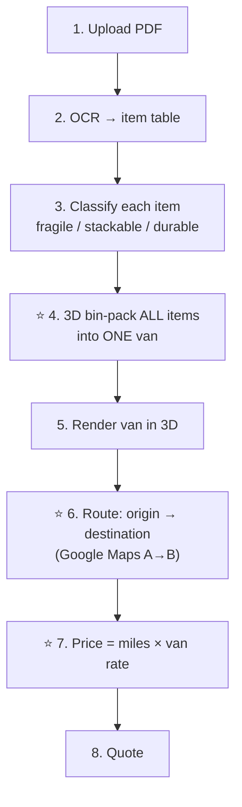
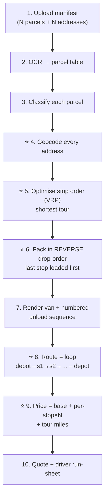
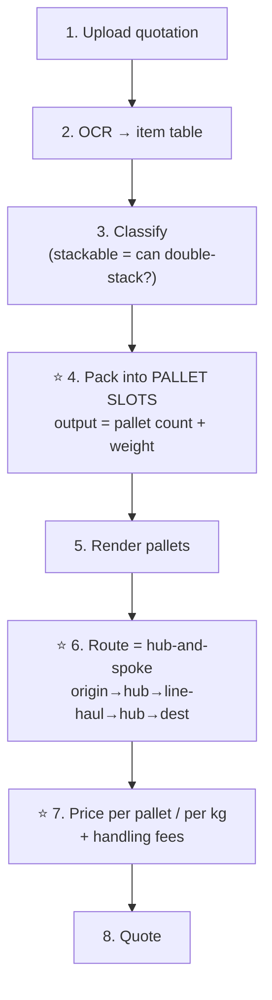
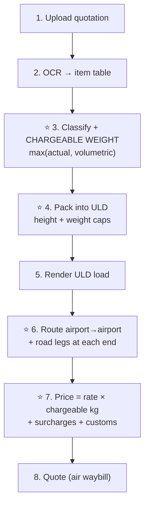
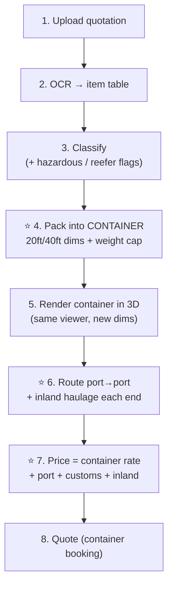

# Logistics Modes — User Flows

> **Purpose:** show how the pipeline behaves for *different types of logistics*, not just today's
> van-based single-drop. Each mode is a full walk-through: plain-text micro-steps first, then a
> Mermaid flow. The shared core (Ingest → Classify) never changes; only **Pack / Route / Price**
> carry the "logistics DNA". See [`architecture.md`](architecture.md) for the base pipeline and
> the swap-seam table this design plugs into.

## How to read this doc

Every mode runs the same 7 conceptual steps. What *changes* between modes is marked ⭐.

| Step | Shared? | What it does |
|------|---------|--------------|
| 1. Ingest | ✅ same everywhere | OCR the uploaded PDF/manifest into a structured table |
| 2. Classify | ✅ same (mostly) | Tag each row: fragile? stackable? durable? |
| 3. Pack | ⭐ mode-specific | Decide how/where cargo physically goes |
| 4. Visualise | ✅ same shell | Render the load + sequence |
| 5. Route | ⭐ mode-specific | Work out the journey |
| 6. Price | ⭐ mode-specific | Turn the journey + cargo into money |
| 7. Quote | ✅ same shell | Emit the priced, packable job |

Modes covered: [Road single-drop (today)](#mode-a--road-single-drop-current) ·
[Last-mile multi-drop](#mode-b--last-mile-multi-drop) ·
[LTL shared truck](#mode-c--ltl-less-than-truckload) ·
[Air freight](#mode-d--air-freight) ·
[Sea FCL](#mode-e--sea-freight-fcl).

## The whole design in one picture

Before the per-mode walk-throughs, here is *why* they are all one system. **Ingest →
Classify** and **Visualise → Quote** are built once and never change. Every mode is just a
different **bundle of three engines — Pack · Route · Price** — selected by a single
`LogisticsMode` dial. Air freight is the only mode that also reaches back and changes a
shared step (it adds *chargeable weight* to Classify).

> **Colour key (used in every diagram below):** blue = shared / unchanged · orange =
> mode-specific work (⭐) · red = the mode dial or a fail-loud stop.

---

## Mode A — Road single-drop (current)

**In one line:** one pickup, one drop-off, fill one van, charge by the mile.

**Micro-steps:**
1. **Upload** — user drops a PDF quotation into the DropZone.
2. **OCR** — the table is read; each row becomes a raw item (name, dimensions, qty, weight).
3. **Classify** — each item is tagged fragile / stackable / durable via the rule + durability classifier.
4. **⭐ Pack** — the 3D bin-packer places every item inside ONE van, respecting stacking rules and crush-pressure. Items that don't fit are flagged.
5. **Visualise** — the packed van is drawn in the 3D viewer.
6. **⭐ Route** — Google Maps gives distance/time for a single origin → destination leg.
7. **⭐ Price** — cost = miles × per-mile rate for the chosen van, + any surcharges.
8. **Quote** — one van, one route, one price.

---

## Mode B — Last-mile multi-drop

**In one line:** one van, many parcels, many delivery addresses — the courier round.

**What changes vs today:** you now have *multiple destinations*, so the van must be packed in the
right unload order and the route becomes a tour, not a straight line.

**Micro-steps (⭐ = differs from Mode A):**
1. **Upload** — manifest with N parcels, each carrying its own delivery address.
2. **OCR** — same table read; address column is now meaningful.
3. **Classify** — same fragility/stacking tags per parcel.
4. **⭐ Geocode** — every delivery address is turned into map coordinates.
5. **⭐ Optimise stop order** — a route optimiser (VRP — "vehicle routing problem") finds the shortest sensible tour through all stops from the depot and back.
6. **⭐ Pack in reverse drop-order** — the parcel for the *last* stop is loaded *first* (deepest in the van); the first stop's parcel sits by the doors. Stacking rules still apply.
7. **Visualise** — van load shown *with the unload sequence numbered*.
8. **⭐ Route** — a multi-leg loop: depot → stop 1 → stop 2 → … → depot.
9. **⭐ Price** — base callout + per-stop fee × N + total tour miles.
10. **Quote + driver run-sheet** — ordered list of stops for the driver.

---

## Mode C — LTL (less-than-truckload)

**In one line:** your goods don't fill a truck, so they *share* one with other people's freight,
moving through sorting hubs.

**What changes vs today:** you no longer own the whole vehicle. Cargo is measured in **pallet
spaces**, and the journey runs through consolidation hubs rather than direct.

**Micro-steps (⭐ = differs from Mode A):**
1. **Upload** — quotation of goods (often already palletised).
2. **OCR** — same table read.
3. **Classify** — same tags; stackability now decides if pallets can be double-stacked.
4. **⭐ Pack into pallet slots** — items are grouped into standard pallet footprints; the output is "how many pallet spaces + total weight", not a full-van 3D layout.
5. **Visualise** — pallets rendered (fewer, bigger blocks than loose items).
6. **⭐ Route via hub-and-spoke** — origin → local hub → line-haul → destination hub → delivery. Multiple legs, shared vehicles.
7. **⭐ Price per pallet / per weight** — freight class × pallet count or chargeable weight, + hub/handling fees.
8. **Quote** — pallet spaces booked on shared lanes.

---

## Mode D — Air freight

**In one line:** fast, weight-critical, airport-to-airport, priced on *chargeable weight*.

**What changes vs today:** air pricing punishes bulky-but-light cargo via **volumetric weight**,
so Classify must compute chargeable weight, and packing targets aircraft ULDs (unit load devices),
not a van.

**Micro-steps (⭐ = differs from Mode A):**
1. **Upload** — quotation of goods.
2. **OCR** — same table read.
3. **⭐ Classify + chargeable weight** — for each item, compare actual weight vs volumetric weight (volume ÷ air dim-factor); the larger is the *chargeable weight*. Also flag dangerous goods.
4. **⭐ Pack into ULD** — items packed into aircraft containers/pallets with height contours and weight caps.
5. **Visualise** — ULD load shown.
6. **⭐ Route airport-to-airport** — nearest origin airport → (transit) → destination airport, on flight schedules; road legs to/from airports appended.
7. **⭐ Price per chargeable kg** — rate × chargeable weight + fuel/security surcharges + customs.
8. **Quote** — air waybill-style quote.

---

## Mode E — Sea freight (FCL)

**In one line:** goods stuffed into a shipping container, port-to-port on a vessel schedule.

**What changes vs today:** the "van" becomes a **20ft/40ft container**, the route follows **port
sailing schedules**, and price is **per container** (FCL) rather than per mile.

**Micro-steps (⭐ = differs from Mode A):**
1. **Upload** — quotation of goods.
2. **OCR** — same table read.
3. **Classify** — same tags; note hazardous/reefer needs.
4. **⭐ Pack into container** — 3D stuff into a 20ft/40ft box (very similar geometry to your van packer — just a different set of dimensions and weight limit).
5. **Visualise** — container load in 3D (reuses your viewer with new dimensions).
6. **⭐ Route port-to-port** — origin port → sailing → destination port, on schedule; inland haulage legs appended each end.
7. **⭐ Price per container** — flat container rate + port charges + customs + inland legs.
8. **Quote** — container booking quote.

---

## What this means for the code

Read across all five diagrams and the pattern is stark:

- **Steps 1, 2, 7 are identical in every mode** → build once, reuse forever (Ingest, and the
  Visualise/Quote output shell).
- **Step 3 (Classify) is identical except air freight**, which adds *chargeable weight*.
- **Steps 3-pack, 5-route, 6-price are the only real per-mode work.**

That is exactly why the branching design (see the placement doc / `src/lib/logistics/`) swaps a
**bundle of three engines** — packer + router + pricer — behind one `LogisticsMode` dial, and
leaves everything else untouched. Sea-FCL in particular reuses your existing 3D packer and 3D
viewer almost verbatim — only the box dimensions and the route/price engines change.

| Mode | New packer? | New router? | New pricer? | Classify change? |
|------|-------------|-------------|-------------|------------------|
| A — Road single-drop | — (have it) | — (have it) | — (have it) | — |
| B — Last-mile | yes (drop-order) | yes (multi-stop) | yes (per-stop) | — |
| C — LTL | yes (pallet-slot) | yes (hub-spoke) | yes (per-pallet) | — |
| D — Air freight | yes (ULD) | yes (airport) | yes (per-kg) | yes (chargeable wt) |
| E — Sea FCL | reuse van packer w/ new dims | yes (port) | yes (per-container) | — |

---

## Ground-transport ideas not yet built

> **Purpose:** a menu of *road/rail* models we could plug in later. None of these exist in the code
> yet — they're candidates. Modes A, B, C above are already the "single-drop", "multi-drop", and
> "shared-truck" ground cases, so everything here is *deliberately different* from those. Each one
> below is written the same way: one plain-line summary, then the **core logic sequence** — the
> exact order of thinking the software would follow — explained like you're 14.

### Idea 1 — FTL (full truckload, direct)

**In one line:** the load is big enough to fill a whole truck, so it goes straight from A to B with
no sharing and no hubs — the opposite of the LTL mode (C).

**Why it's different:** in LTL you rent *pallet spaces* and your goods ride through sorting hubs. In
FTL you rent the *entire truck* and it drives door-to-door. Cheaper per item when you have a lot,
and much faster because nothing gets unloaded and re-sorted on the way.

**Core logic sequence (plain text):**
1. Add up the whole load's volume and weight.
2. Ask: *does this fill (or nearly fill) a truck?* If yes → FTL makes sense. If it's only a few
   pallets, the software should push you back to LTL instead — don't rent a whole truck for 3 boxes.
3. Pick the smallest truck the load still fits in (a 40-tonne trailer for a light load wastes money).
4. Pack it as one solid load — same 3D packer we already have, just a trailer's dimensions.
5. Route is the simple straight A→B leg (we already do this in Mode A).
6. Price is **flat per truck for the trip**, not per mile and not per pallet — you're buying the
   vehicle's time, so it's one lump sum (plus fuel and any waiting-time charge).

**Think of it like:** hiring a taxi just for yourself (FTL) versus sharing a bus with strangers (LTL).

### Idea 2 — Backhaul / return-load matching

**In one line:** a truck that just dropped off a load is about to drive home empty — fill that empty
trip with someone else's cargo going the same way, at a discount.

**Why it's different:** every mode above prices a job *on its own*. Backhaul prices a job by looking
at what trucks are *already going to be near there anyway*. An empty return trip is wasted money for
the carrier, so they'll happily carry your goods cheap rather than drive home with air.

**Core logic sequence (plain text):**
1. Keep a live list of trucks that are finishing a job and where they'll be empty, and when.
2. A new quote comes in: note its pickup point, drop point, and time window.
3. Search that list for a truck whose *empty leg* roughly lines up with this job's direction and
   timing — same corridor, same-ish day.
4. Score each match on how big the detour is (a tiny detour = great match, a huge one = ignore it).
5. If a good match exists → offer a **discounted backhaul price** (the carrier only charges for the
   detour and handling, not the whole trip, because they were driving that way regardless).
6. If no match → fall back to a normal full-price quote.

**Think of it like:** a friend driving back to your town anyway offers to carry your bag for petrol
money, instead of you paying full courier price.

### Idea 3 — Milk-run (scheduled collection loop)

**In one line:** instead of many suppliers each sending a separate van, ONE van drives a fixed
circuit picking a little up from each of them on a repeating timetable.

**Why it's different:** Mode B (multi-drop) *delivers* to many stops from a full van. A milk-run
*collects* from many stops into an empty-then-filling van, and it runs on a **schedule** (same loop
every Tuesday, say), not as a one-off tour.

**Core logic sequence (plain text):**
1. Take the fixed list of supplier stops on this loop.
2. Work out a good repeating order to visit them (shortest sensible circle back to base).
3. At each stop, add that supplier's small pickup into the van and re-check it still fits.
4. Because the van *fills up as it goes*, pack it so early pickups sit deep and late pickups sit near
   the door — the reverse of the delivery version in Mode B.
5. Route is a **loop that repeats on a timetable**, so price is spread across all the suppliers
   sharing that run rather than charged to one customer.
6. Output a recurring schedule + a per-supplier share of the cost.

**Think of it like:** the old milkman — one float, same streets, same time, a bit collected/dropped
at each door — hence the name.

### Idea 4 — Cross-dock / zone-skip (hub injection)

**In one line:** goods are trucked in bulk to a hub near the destination city, then split there onto
local vans for the final leg — skipping the slow national sorting network.

**Why it's different:** LTL (Mode C) sends your pallets *through* the carrier's hubs where they get
sorted with everyone else's. Cross-docking is deliberate: you fill a big truck to the destination
region yourself, and only at the *last* hub does it break into small local drops — less handling,
faster, and you "skip" the early sorting zones.

**Core logic sequence (plain text):**
1. Group all parcels by which destination *region* they're headed to.
2. For each region with enough volume, load a big truck to that region's local hub (one long, cheap
   line-haul leg).
3. At the hub, the truck is *cross-docked* — unloaded and immediately reloaded onto small local vans,
   never put into storage.
4. Each local van then runs a short multi-drop round (this part reuses Mode B).
5. Price = one cheap bulk line-haul + local delivery costs, instead of paying full per-parcel
   long-distance rates.

**Think of it like:** flying to one big airport then taking a local bus, instead of a slow train that
stops in every single town on the way.

### Idea 5 — Heavy-haul / abnormal load

**In one line:** the cargo is too big, heavy, or wide for a normal truck — it needs a special
trailer, legal permits, and sometimes escort cars and a planned route that avoids low bridges.

**Why it's different:** every mode above assumes the load fits inside a standard vehicle and any
public road works. Here the *vehicle and the road itself* become the hard constraints — a single
turbine or bridge beam can't just take any motorway.

**Core logic sequence (plain text):**
1. Measure the single biggest item. If it's over the legal limits for width/height/weight → this mode
   triggers instead of normal packing.
2. Pick a specialist trailer (low-loader, extendable, multi-axle) rated for that size and weight.
3. Instead of a normal route, check the road for **clearances** — bridge heights, weight-limited
   roads, tight roundabouts, overhead cables — and route *around* anything that won't fit.
4. Work out what **permits** are legally needed and whether **escort vehicles** or police notice are
   required for the size.
5. Price = specialist trailer + permit fees + escort costs + the (often longer) detour route, not a
   simple per-mile rate.

**Think of it like:** moving a giant wardrobe through a house — you don't just carry it, you first
check every doorway and corner it has to pass, and maybe take a door off.

### Idea 6 — Intermodal rail-road

**In one line:** the same container rides a *train* for the long middle stretch (cheap, low-carbon)
and only uses trucks for the short bits at each end to and from the rail terminal.

**Why it's different:** all the ground modes above are truck-only, start to finish. Intermodal mixes
two vehicles for one journey — the box never gets unpacked, it just gets craned from truck to train
and back.

**Core logic sequence (plain text):**
1. Pack goods into a container (reuses the Sea-FCL packer — same box shape).
2. Find the nearest rail terminal to the pickup and the nearest one to the destination.
3. Build a three-leg journey: **truck → train → truck**. The middle train leg follows a *timetable*,
   so timing depends on train departures, not the driver.
4. Add the road "drayage" legs at each end (short truck hops to/from the terminals).
5. Price = short road leg + rail leg (priced per container-distance) + short road leg + terminal
   lift/handling fees. Often cheaper and greener than trucking the whole way.

**Think of it like:** you drive to the station, put your car on a car-train through the mountains,
then drive off the other side — the long boring middle is done by rail.

### Idea 7 — Reefer (temperature-controlled road)

**In one line:** same road delivery as today, but the cargo (food, medicine) must stay cold or
frozen the entire way, in a refrigerated van or trailer.

**Why it's different:** every mode above only cares about *shape and weight*. Reefer adds a new rule
the classifier has to respect — a **required temperature** — and mixing incompatible temperatures in
one vehicle is forbidden even if they'd physically fit.

**Core logic sequence (plain text):**
1. During Classify, tag each item with its needed temperature band (ambient / chilled / frozen).
2. When packing, only allow items of the *same* temperature band into the same reefer compartment —
   you can't put ice cream next to fresh flowers even if there's space.
3. If the load has mixed bands, either use a multi-zone reefer (split compartments) or split it across
   vehicles.
4. Route is a normal road leg, but flag any long stretch where keeping temperature is risky.
5. Price = normal delivery + a **cooling surcharge** (the fridge unit burns extra fuel) + any
   compartment-split cost.

**Think of it like:** your fridge and freezer at home — same kitchen, but frozen and fresh food have
to live in separate boxes at their own temperatures, or the food spoils.

---

**How these would slot in:** notice every idea still only changes the same three ⭐ engines —
**Pack, Route, Price** — plus the occasional Classify tag (temperature for reefer, over-size for
heavy-haul). None of them touch Upload, OCR, or the Quote shell. That's the whole point of the
swap-seam design: a new ground mode is "write three small engines, leave everything else alone."
