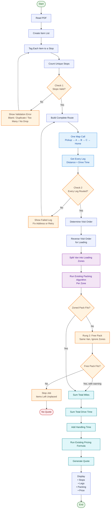

# Multi-Stop Full-Load — Core Logic

> **In one line:** today a van drives to **one** drop. This teaches it to drive a short
> chain of stops on the same trip (pickup → A → B → C → home) for **one customer, one full
> load** — and to **pack, order, time and price** that chain correctly.

This is the **multi-drop delivery** setting of a reusable **stop-chain engine** (§1A).
Multi-pickup collection is the *same* engine with a different mix of stops — not a second project.

---

## 1A. The stop-chain engine (the reusable core)

A run is an **ordered list of stops**. Each stop carries three things: its **address**, its
**kind** (`pickup` or `drop`), and **which items belong to it**. Any model that can produce
such a list can drive the engine.

The engine does five things, all **blind to pickup-vs-drop**:

1. **Pack** the van by stop order (§5-in-steps).
2. **Route** every leg (stop→stop→…→home) in one call.
3. **Sum** the miles **and** the drive-time across every leg.
4. **Price** on those totals (today's formula, untouched in shape).
5. **Show every leg** and **stop loudly** on any bad stop or leg (§4).

Because those five are kind-blind, **delivery and collection are one module**:

| Configuration | Stop list | Job |
|---|---|---|
| **Multi-drop delivery** *(this doc)* | `[pickup, drop, drop, drop]` | one pickup, several drops |
| **Multi-pickup collection** | `[pickup, pickup, pickup, drop]` | several pickups, one drop |
| ~~Milk-run~~ *(cut from V1)* | pickups and drops interleaved | future — needs interleaved zoning, not reversed bands |

**Two things vary by configuration — both _injected by the calling model_, never hardcoded:**

1. **The validation rule** (§4 Check 1): delivery = 1 pickup + 1..`maxStops` drops; collection =
   1..`maxStops` pickups + 1 drop. The engine calls a supplied "are these stops allowed?" test —
   there is **no** baked-in "must start with a pickup."
2. **The pack-order strategy** (Step 5): delivery loads back-to-front (last drop deep, first drop
   at the doors); collection is the mirror. Pluggable, chosen by the model.

Everything else — routing, per-leg summing, the return leg, the fail-loud checks, pricing — is
shared. If a model-specific fact ever needs to enter the engine, pass it **through the injected
validator/strategy**; don't hardcode it inside.

---

## 1. The four changes, micro-planned

They run in this order: **route → pack → price**. Routing leads because the packing order can
come from the map (Change 2, step 1). The numbers below are the four changes; each lists its
steps and the one checkpoint that guards it.

### Change 2 — The stops in between  ·  *build: Step 4*
1. **Get the visit order** — use the order the operator typed, or ask the map to work out the
   cheapest order (one opt-in setting).
2. **Route the whole chain in one map call** — pickup → A → B → C → home.
3. **Read back miles _and_ time for every leg**, not just one grand total.

→ **Check 3:** every leg must come back with real miles, or the job **stops and names the bad
leg** — never a total built on a gap.

### Change 1 — How the van is packed  ·  *build: Steps 2 + 5*
1. **Each item is already tagged to its stop** (Step 2), so the van knows what goes where.
2. **Take the visit order** from Change 2.
3. **Split the van into one band per stop** — the last stop deep at the front, the first stop by
   the doors — each band sized to that stop's volume.
4. **Pack each band with today's packer** — the packing brain is unchanged. **Safety always
   wins:** anything that can't sit safely is shown as "left over", never crushed to honour order.

→ **Check 2:** if anything is left over, the load doesn't fit one van — the job **stops before
any price**.

### Change 3 + 4 — The time, and the price it drives  ·  *build: Step 6*
These are **one cause-and-effect**: *more stops → more time and more miles → higher price.* Two
meters push the price up, and they rise together:
1. **Time → the driver's pay.** Add up every leg's drive-time (including the drive home) **plus a
   per-stop handling allowance** — a config knob for the minutes to load/unload at each stop, so
   extra stops cost driver time even when they sit close together. Hours × hourly rate = the
   driver-pay line, which already exists and now covers the whole trip.
2. **Miles → van rate + petrol.** More stops usually means more miles, and both the van's
   per-mile rate and the fuel cost climb with distance. (Petrol tracks *miles*, not sitting time.)

Today's formula then runs on the bigger totals, with the **drive home counted once**. A
single-drop job still comes out **exactly as today**.

**Nothing else changes:** reading the PDF into items, classifying them, the **packing heuristic
itself** (Change 1 *wraps* it, never edits it), and the **shape** of the price formula — it
already multiplies whatever totals it's handed.

---

## 2. The pipeline, end to end

| Step | What it does | Change |
|---|---|---|
| **Read PDF** | Scan the quote into an item table | None |
| **Tag items** ⭐ | Operator tags each item row to its stop | **NEW: a side table maps item → stop (Step 2)** |
| **Classify** | Fragile / stackable / durable | None |
| **Route** ⭐ | Visit order + miles **and** time for each leg | **NEW: takes a stop list, one call (Step 4)** |
| **Pack** ⭐ | Fit items into one van, **by drop-order**, free-pack fallback if zoning overflows | **NEW: a zoned packer wraps today's packer (Step 5) + a fit-fallback ladder (Step 5b)** |
| **Price** ⭐ | Today's formula on summed totals | **NEW: drive-time covers the whole chain; return leg once (Step 6)** |
| **Quote** | Show stops, legs, packing, price | Shows **each leg's miles + time** and per-stop packing (Step 8) |

> Optional add-on: pull the from/to addresses off the PDF to pre-fill the form. Doesn't touch
> how item rows are read. Nice-to-have, not core.

### The same logic, as a picture

The picture is built around the **4 things that change**: how the van is **packed**, the
**stops in between**, the **time** taken (which sets the driver's pay), and so the **price**.
Colours: **blue = unchanged** · **orange = one of the 4 changes** · **red diamond = a checkpoint**
(§4) that stops a wrong quote escaping — not a dead end, it says what to fix.

---

## 3. Micro-steps (in order, each independently verifiable)

Each step says **what to build** and **what NOT to do in it** — that keeps one step's scope from
leaking into the next.

**Step 1 — The `maxStops` config knob (a risk ceiling + kill-switch).**
A typed knob read through the one config layer (`src/config/env.ts`, the sole reader of
environment/config), default **3**, minimum **1**. Not in `vans.json` (fleet data), not a
hardcoded constant. `= 1` ships single-drop only; raise it to enable multi-stop. It does **not**
define a job's stop count — the tags do (Step 2). While here, reject a `ROUTE_RETURN_FACTOR` of
**0** at config load (today the loader only rejects negatives, so `0` passes then throws on *every*
quote in `calculator.ts` — a bad config must fail at startup, not on the first customer).
*Don't:* treat `maxStops` as "the number of stops."

**Step 2 — Tag each item to its stop (a side table, not an `Item` field).**
Keep a **destination table** mapping `bulk / item id → stop`, filled as the operator tags rows in
the review table. Why a side table beats a `stopIndex` column on `Item` (`packing.types.ts`):
- The item stays **exactly as today** — sorting and packing read today's item; only the new
  "which stop" step reads the table. Keeps the "Classify unchanged" promise.
- **Stops = `COUNT(DISTINCT stop)`** — the count is *derived*, never typed, so you can't type 3
  stops but tag items to 2. The stop list and the tags are the **same one fact**.
- **Keyed by bulk id** — "12× dining chairs" is one row tagged once, not twelve items.

*Don't:* add a destination field to `Item`.

**Step 3 — Carry `legs[]` on the journey record.**
Add a `legs[]` field **alongside** the existing `distanceMiles` — keep the scalar as the **summed
total** so today's readers (price labels, quote-history, UI) keep working. **Two Route/Quote shapes
exist:** `src/lib/pricing/types.ts` **and** a separate `src/types/api.ts` (`:130`) — and it's the
`api.ts` one that quote-history and the client use (`quote-history.store.ts`). Add `legs[]` to
**both** and keep them in sync, or the legs never reach the saved quote or the screen.
*Don't:* change the pricing formula, or touch routing/UI yet.

**Step 4 — Routing takes a stop list.**
Change `getRoute(origin, destination)` (`src/lib/routing/types.ts`) to accept the pickup + ordered
stops and return **miles _and_ drive-time per leg, plus totals**. Today the Google provider asks
only for the route **total** (field mask `routes.distanceMeters,routes.duration`,
`google-maps.provider.ts:15`) between one origin+destination (`:42-48`). For per-leg figures: add
`routes.legs.distanceMeters,routes.legs.duration` to the field mask **and** an `intermediates[]`
array — **one call** (this moves the call from the Essentials tier to Routes Advanced, ~2× per
call — still far cheaper than N calls).
- **Order (work it out when not given):** use the operator's order if typed; if not, ask Google for
  the drive-optimal order in the **same** call with `optimizeWaypointOrder: true`
  (→ `optimizedIntermediateWaypointIndex`), behind a config flag (opt-in; higher tier). The order
  drives the packing bands (Step 5).
- **Return leg:** set the call's `destination` to the origin, so the drive home comes back as the
  final leg natively (no extra call). **But** the **stored** `Route.destination` (`pricing/types.ts`,
  `api.ts`) must stay the **last drop C** — else every saved and shown quote renders "pickup →
  pickup" and the real final drop vanishes (`QuotePanel.tsx`, `QuotationHistory.tsx`).
- **Whole-journey budget + per-leg memory:** each leg has its own ~10s limit (`timeoutMs`,
  `env.ts`), so three legs run ~30s uncapped — add a whole-journey time budget, and **store each
  leg's result** so a retry can patch one leg without re-running the rest (Check 3 needs this).
- **Straight-line fallback:** sum per leg the same way; share **one process-wide** bounded cache +
  a ≤1/second queue across all requests — the free geocoder (Nominatim, `straight-line.provider.ts`)
  IP-blocks bursts, and concurrent `/api/quote` calls would otherwise burst together.

*Don't:* hardcode a "must start with a pickup" rule — the stop-kind mix is the injected validator
(§1A), so the same routing serves collection and delivery.

**Step 5 — Pack by drop-order (a zoned packer wrapping today's packer).**
The van interior is a box with `x` = length, `y` = width, `z` = up, origin at a bottom corner
(`packing.types.ts:4-6`); the loading door is a width×height aperture at one end
(`Van.doorAperture:106`), so the door plane sits across `x` — **`x` is the depth axis, doors→cab**.
Slice `x` into one contiguous band per stop in **reverse visit order**: the **last** stop gets the
deepest band, the **first** stop the band at the doors; set each band's length ∝ that stop's total
item volume. Pack each band with **today's packer, untouched** — the existing first-fit-decreasing
scorer (`heuristic-packer.ts`) over the band's `x`-range, same safety sort (sturdy bases down,
fragile last, `:154-163`) and same `validatePlacement` checks. **Safety wins:** any item that can't
be placed safely in its band goes **`unplaced`** (surfaced, never crushed) rather than forced into
unload-order. Wire it as a **swap-seam** — a new `ZonedPacker` implementing the existing `Packer`
interface (`packing.types.ts:166`), calling `HeuristicPacker` once per band and merging placements
(offset each by its band's `x`). **The current packer is not touched.**
**Cost to accept, out loud:** zoning splits one free 3D pack into several constrained packs, so
fill drops at each band boundary — a load that fits one van today can overflow once zoned, pushing
it to a bigger van and **changing the price**. That's a real pricing consequence, caught by Check 2.
*Don't:* edit `HeuristicPacker`. Confirm which end (`x=0` or `x=length`) faces the doors and document
it once. (This is the §1A pack-order strategy — collection just reverses the band order.)

**Step 5b — The pack-fit fallback ladder (recover space before buying a bigger van).**
Zoning wastes space at every band boundary (Step 5's stated cost), so a load that fits one van as a
single free pack can overflow once zoned. Don't jump straight from "neat pack overflows" to "bigger
van" — step down a **3-rung ladder**, reusing the two packers that already exist (no new packing
brain):
- **Rung 1 — Neat pack** (Step 5, `ZonedPacker`): dividers per stop, driver unloads with zero
  digging. If it fits → best case, done.
- **Rung 2 — Plain pack + a loud warning** (`HeuristicPacker`, the free pack you already have): if
  Rung 1 leaves anything `unplaced`, re-pack the **same van** ignoring zones. If it now fits, return
  the quote with a non-fatal warning (like the straight-line notice, `engine.ts:94`): *"Fits one van
  — but items for earlier stops sit behind later ones; the driver will need to move some boxes at
  each stop."* The operator chooses: accept the digging, or pay for the bigger van — **hand them the
  trade, don't decide it.**
- **Rung 3 — Bigger van / split** (today's Check 2): only if **even the free pack** overflows is it a
  genuine no-fit — then the Check 2 message is truthful ("doesn't fit one van"), not "doesn't fit
  *neatly*."

This is orchestration in `quoteStopChain` (`engine.ts:104-111`): on `packing.unplaced.length > 0`,
try the free packer once before throwing the fit error; a survived Rung 2 pushes the digging notice
into `warnings`. The more stops a job has, the more often it lands on Rung 2 — so instead of silently
inflating van size (and price) with every extra stop, the operator sees exactly what the stops cost.
*Don't:* build partial/relaxed zoning ("relax only the tightest boundary") — that's real 3D-packing
research for a marginal gain and can't be explained to a customer. Two whole-van attempts, not clever
half-measures.

**Step 6 — Price the chain (sum legs, drive home once, driver's time on the whole trip).**
Feed the summed total miles into the existing `calculateQuote`. The return drive is **one extra
leg (C→origin** — there is no separate depot; today's ×2 already means "back to the pickup"**)**,
taken from the same routing call. Bill the chain at return factor **1.0**, so the trip home is
counted **once**, not by doubling every leg. **Sum the drive-*time* per leg the same way**
(including the return leg) into `route.durationSeconds` — labour is billed on duration
(`calculator.ts:100`), so if only miles are summed the drive home's *time* vanishes and the labour
line under-charges. **Add a per-stop handling allowance into those hours** — a config knob
(`env.ts`: minutes to load/unload per stop) × the stop count — so extra stops cost driver time even
when they sit close together (this is the old "per-stop cost", now built in, not deferred).
`ROUTE_RETURN_FACTOR` is **one global number** that also drives fuel and labour
(`calculator.ts:51,82,100`; read at `pricing/index.ts:74`), so single-drop@2.0 and multi-stop@1.0
can't both come from it — work the factor out **per quote** in the route builder.
**Single-drop parity:** for one drop, reuse the outbound leg's own miles/time for the return (not a
fresh drop→origin measure), so `maxStops = 1` matches today exactly.
*Don't:* change the pricing formula itself — it already multiplies whatever total it's handed.

**Step 7 — Fit check + form + API.**
Right after packing, if any item is left over (`PackingResult.unplaced` not empty), **stop — don't
price a load that can't fit** (Check 2). Swap the single drop-off box for an ordered list; `/api/quote`
accepts a stop list and runs the fail-loud checks (§4).
*Don't:* auto-split across two vans — a different, bigger project.

**Step 8 — Show every leg on the quote.**
List each stop and each leg's **miles + time**, including the return leg (C→origin) as its own
line, plus how the van is packed per stop. Round each leg, then make the total the **sum of the
rounded legs** — else the legs shown (1 dp) won't add up to a total summed from unrounded miles and
a checker will think the maths is broken. At factor 1.0 the old "round trip" note disappears
(`calculator.ts:52,71`), so the return leg **must** show as a visible line or the label reads like
an inflated one-way number. Build the map's waypoints in `QuotePanel.tsx:16` (`mapSrc`) —
`waypoints=A|B`, destination = the final drop C.
*Don't:* hide any leg behind a single number.

---

## 4. Fail-loud checks (never guess forward)

Three checks the new logic must enforce — a wrong quote must never slip out. A **stop** is a
**fixable pause**, not a dead end: each one tells the operator **(1) which** stop or leg is wrong,
**(2) why**, and **(3) the exact thing to type** to clear it. The job keeps everything else the
operator entered and re-runs the moment the one bad field is fixed.

- **Check 1 · Are the stops OK?** The kind-mix rule is the **injected validator** (§1A), in its
  **delivery** setting: at least 1 pickup + 1 drop, no blanks, no repeats, ≤ `maxStops`. Point at
  the wrong box: blank → "Stop 3 is empty — type an address or remove it"; repeat → "Stop 2 and
  Stop 4 are the same — change one or drop it"; too many → "You've entered 5 stops; the limit is 3
  — remove 2, or split into a second job"; no drop → "Add at least one drop-off after the pickup."
  (Collection swaps in *many pickups + 1 drop* — same check, different predicate.)
- **Check 2 · Does it all fit one van?** After packing — and after the Step 5b fallback ladder has
  tried the **free pack** too — if **any** item is *still* left over (`PackingResult.unplaced` not
  empty), **stop — don't price a load that can't fit**: "This load doesn't fit one van — N items left
  over. Remove some items, use a bigger van, or split the job." Only a load that overflows *even
  unzoned* trips this — the real hard limit on a job (not the stop count, not the zoning).
- **Check 3 · Did every leg get real miles?** If any leg can't be routed, **stop and name it** —
  never build a total from a missing leg. Address not found → "Leg A→B failed: the map couldn't find
  'B' — check the postcode and re-enter Stop B" (keep every other leg's miles; only re-check the
  fixed one). Map down / timed out → "Leg B→C couldn't reach the map — try again, or type the leg's
  miles in by hand" (a visible override beats a silent straight-line guess that quietly
  under-prices). Zero-mile leg → reject any leg whose distance is ≤ 0: "Leg A→B is 0 miles — are
  Stop A and Stop B the same place?" The total waits until **every** leg has a real, known number.

---

## 5. Done when

- [ ] A quote runs for a pickup + 2–4 ordered stops.
- [ ] Each item is tagged to a stop; the stop count is the **distinct tags**, never typed in.
- [ ] The van packs by drop-order (last stop deep, first stop at the doors); any item that can't be
  placed safely surfaces as **unplaced**, never crushed.
- [ ] When zoning overflows one van, a **free pack** is tried before demanding a bigger van; if it
  fits, the quote is returned with a loud "driver must move boxes at each stop" warning; only a load
  that overflows even unzoned stops the job (Step 5b ladder).
- [ ] Each leg's **miles and time** show separately and sum to the totals.
- [ ] Price uses today's formula on the summed totals, driven by two meters — **time** (drive +
  per-stop handling → driver pay) and **miles** (van rate + petrol) — with the drive home
  (C→origin, factor 1.0) counted **once**; a single drop still matches today.
- [ ] Over-cap / blank / duplicate / no-drop stops are rejected with a clear fix message.
- [ ] A load with leftover items (won't fit one van) stops the job — no price (Check 2).
- [ ] A single unroutable or zero-mile leg stops the job and names the leg.
- [ ] A leg that falls back to a straight-line guess is flagged loudly on the quote.
- [ ] `maxStops = 1` reproduces today's single-drop exactly (return reuses the outbound leg).
- [ ] Read-PDF, Classify, the packing **heuristic**, and the 3D viewer are unchanged.

