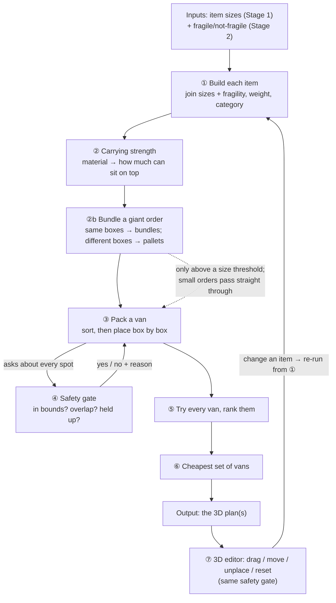
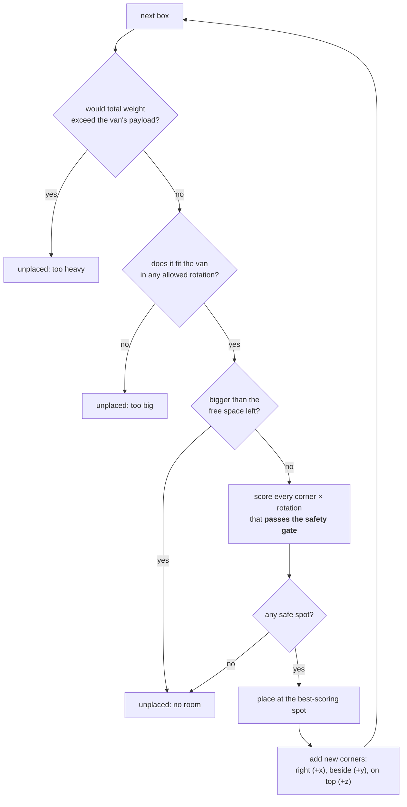
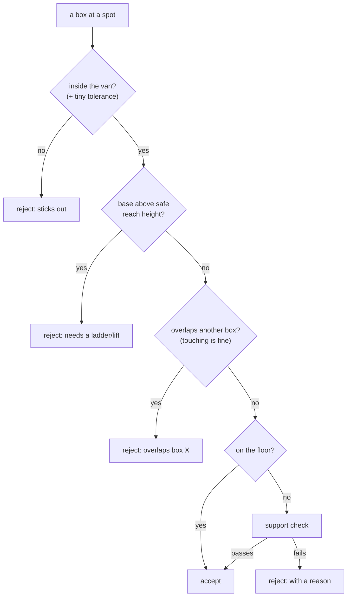

# Stage 3 — How the van gets packed

How a quotation becomes a real 3D loading plan. We start with an empty van and a list
of items (size, weight, fragility) and end with an exact map of where every box goes —
and, if it won't all fit, which extra vans to add.

- Think **3D Tetris with real rules**: heavy sturdy things on the bottom, fragile things
  on top, nothing ever placed where it would be crushed.
- Everything is **pure, predictable code**: the same items always produce the same plan.
  That's what lets the 3D view draw it and lets us test every rule.

---

## The whole flow

> Quotation items + empty vans → ① build each item → ② work out how much each can carry →
> ②b bundle a giant order into a few big bundles → ③ sort, then place box by box → ④ check
> every placement is safe → ⑤ try every van and
> rank them → ⑥ if one isn't enough, find the cheapest set → **a 3D plan** → ⑦ a person can
> drag / move / unplace boxes, re-checked by the same rules.



> **Why "good enough", not perfect.** Packing a van *optimally* is too slow for a computer
> to solve exactly. So we use a **greedy** method: place one box at a time in the best spot
> available *right now*, and never move it again. Fast, sensible, and **always safe** — it
> just leaves a little space unused ([Section 8](#8--what-the-packer-doesnt-do)).

**Sizes** are in metres from one bottom corner: **x = length** (front-back),
**y = width** (side-side), **z = up**. Quotation columns map **L → x · P → y · H → z**.

---

## ① Build each item (`item-assembler.ts`)

Two earlier stages each hold half the story — Stage 1 the **sizes**, Stage 2 which rows are
**fragile**. Step ① joins them into one packable item per row:

1. **Read the sizes** (L / H / P) and quantity.
2. **Find the category** from the product code (`column-map.json`) — e.g. base-cabinet, glass-panel.
3. **Set the weight:** the quotation's weight if given, else `volume × category density`.
4. **Mark it `stackable: true`** — it *can be lifted onto* a suitable base. Whether anything
   may sit **on top of it** is decided only by carrying strength (step ②), never a flag.

**Never invents a missing size.** A blank or unreadable dimension → the item is set aside as
**unplaced** with a reason, never made up. (One physics exception: two sizes plus a real
weight lets us *derive* the third from `weight ÷ density ÷ area` — that's calculation, not a guess.)

---

## ② How much can sit on top (`item-assembler.ts` + durability)

Each item gets **two carrying limits** from its category (`config/stackability.json`):

- **Crush limit** (`maxStackPressureKpa`) — how much *pressure* its top can take.
- **Weight ceiling** (`canSupportWeightKg`) — hard cap on *total kilograms* on top.
  **`0 kg` = nothing may ever sit on it.**

| Category | Weight ceiling (kg) | Crush limit (kPa) |
|----------|:--:|:--:|
| heavy-material | 2000 | 300 |
| light-industrial | 500 | 150 |
| base-cabinet | 80 | 40 |
| wall-cabinet | 30 | 25 |
| accessory | 20 | 15 |
| tall-unit (column) | 0 | 15 |
| top (countertop / glass) | 0 | 20 |
| appliance (oven / fridge) | 0 | 12 |
| glass-panel | 0 | 5 |
| *unknown code (fallback)* | 0 | 8 |

That `0 kg` row is why glass, tops, appliances and columns are still **carried**, yet
**nothing is stacked on them**.

**Material makes an item more careful.** A classifier reads material words ("tempered glass",
"solid wood", "foam") and outputs **labels only, never numbers**: a strength tier
(`none / low / medium / high` → 0 / 20 / 60 / 300 kPa), plus `brittle`, `deformable`, and a
rotation lock. The rule is **"can tighten, never loosen"**:

- A **machine guess** may only *lower* the limit: `min(category, tier)`.
- A **human override** *replaces* it (so a reviewer fixing a bad default isn't ignored).
- **Deformable** items (foam, fabric) take a final **× 0.7** — they squash.
- **Brittle** items (glass, ceramic, stone, plasterboard) also take a final **× 0.7** — they
  crack rather than squash, but the effect on the number is the same shape: less may rest on
  top. Before that discount, a brittle item's tier is first capped at **low** — most brittle
  materials (marble, granite, stone…) match no tier keyword and would otherwise default to
  **medium**, letting an unconfident guess out-rank a correctly classified low-tier item once
  the discount applies. The cap only affects this number; the tier *shown* on the item stays
  whatever it was actually classified as.

> Two swappable engines sit behind a factory — a keyword `rule` engine (default) or an LLM
> `groq` engine — both output the same labels. An *unrecognised* word is treated as **medium
> (60 kPa)**; because guesses only tighten, the strongest categories cap down to 60 while
> weaker ones stay put. Safe direction only.

> **Strength, not a separate hazard question.** Earlier this system treated "can anything rest
> on this at all" as a yes/no veto for brittle items, independent of any number. It no longer
> does: brittle now feeds the same *sliding scale* as everything else — material tier, the
> low-tier cap, and the ×0.7 discount all fold into one crush-limit number, so wherever that
> number is read (the gate, the "weight on top" meter), brittleness is automatically respected
> without a separate check. A granite slab still ends up with a much lower number than a solid
> wood shelf of the same size — it just isn't blocked outright the way it used to be.

---

## ②b Turn a giant order into a few big bundles (`consolidation.ts` + `standard-box.ts`)

Now every item has its size (①) and its strength (②). Before we start packing, one more step —
but only when the order is **huge**. The packer (③) can handle about **2,000 things at once**
and no more, so a job always finishes quickly. An order with **thousands of boxes** is too many,
so first we **bundle lots of small boxes into a few big ones**, in three ways. A small or normal
order skips this completely — it only kicks in when an order is really big.

- **Lots of the *same* box → one big bundle.** 14,000 boxes that are all the same get taped
  together into a few big bundles. The packer then handles each bundle like one big box.
  *(Bonus: if the whole order is really just one kind of box, we work out how to fill **one**
  van and copy it — so the answer comes back instantly.)*
- **Lots of *different* small boxes → onto shared pallets.** If the boxes are all different, we
  can't tape them into matching bundles. So we do what a warehouse does: stand them **side by
  side, one layer high, on a wooden pallet** (a flat wooden tray, the standard UK size —
  **1.2 m long × 1.0 m wide**). Nothing sits on top of anything else, so nothing gets squashed.
  **Delicate things get their own pallet with nothing stacked on top.**
- **A "pallets" order → count the pallets, not the pieces.** Some orders say both "14,000
  pieces" *and* "14 pallets" on the same line. We count the **14 pallets** (each the same
  standard **1.2 × 1.0 m** size), not 14,000 loose pieces.

> **We never make anything up, and never lose a single box.** Bundling only *groups* boxes that
> were already there. Each bundle or pallet is only ever as strong as its weakest box, so the
> safety check (④) still won't let anything get squashed. All the sizes and limits are set in
> the config files, not buried in the code. The bundles and pallets then move on through ③–⑥
> just like normal boxes.

---

## ③ Pack one van (`heuristic-packer.ts`)

**3D "biggest-and-sturdiest first" placement**, one van at a time, in four moves.

**A. Turn quantities into boxes.** `quantity: 3` → 3 boxes. Missing size → straight to unplaced.

**B. Sort the boxes** — this decides the whole layout:

```
1. non-fragile AND non-brittle first → fragile or brittle sinks to the end, so it lands on top
2. then highest crush limit          → sturdiest of that eligible group goes down first
3. then largest volume                → big sturdy boxes make a wide platform
4. then by id                         → ties break the same way every time
```

> **Two signals, one tie-break.** `fragile` and `brittle` are two different classifiers
> answering the same practical question — *"can I safely build on top of this?"* — from two
> different sources: Stage 2 reads the item's whole description, Stage 3 reads only its
> material. Both still sink an item to the back of the queue together, but the *gate* treats
> them differently now: a standard item still can't rest on a fragile one at all, while a
> brittle base is judged on its number, same as anything else — that number is just capped low
> by construction (§②). The sort doesn't change what the
> gate would decide; it just avoids *gambling* a general-purpose floor slot on an item that
> rarely makes a good one, without waiting to find out. Crush limit and weight ceiling are still
> computed exactly as before and still break ties **within** each group.

**C. Place each box, one at a time**, trying a list of candidate corners (**anchors**),
starting at the origin. Three quick rejects run before the expensive search:



**D. Score every *safe* spot and pick the best** — not just the first that fits:

```
score =  build upward (stack high)        ← huge reward
       + sit on something (vs a fresh floor cell)  ← huge reward
       − stay near the origin (no stranded floor gaps)  ← tiny nudge
       − lie flat (leave headroom to stack more)        ← tiny nudge
```

The two "up" rewards are **a thousand times bigger** than the tidiness nudges. So the packer
is *always trying to build upward* — a box drops to the floor only when the safety gate (④)
**refuses** every spot above it (e.g. a heavy base can't sit on another heavy base). The
packer never judges legality itself; it only *scores* spots the gate already approved.

> - **Speed on bulk orders:** a full van rejects the next box instantly; a **memo** remembers
>   "boxes of this exact type had no room," so thousands of identical boxes still finish fast.
> - **Corner cap:** the anchor list is capped at **128** (keeping the lowest, most-compact
>   corners); small jobs never hit it.
> - **One pass:** once placed, a box is never moved again, and corners spawn only at box
>   edges. That's the space it leaves on the table ([Section 8](#8--what-the-packer-doesnt-do)).

---

## ③b Worked example — 10 items, step by step

The best way to *feel* the greedy loop. A mini-quotation:

- **3 × Base Cabinets** — heavy, sturdy, high crush limit (40 kPa, holds 80 kg).
- **5 × Wall Cabinets** — medium (25 kPa, holds 30 kg).
- **2 × Glass Panels** — light, brittle, lowest crush limit (5 kPa, holds 0 kg).

**Phase A — the sorting lineup (before any packing).** Sort locks the order once:

```
Boxes 1–3   3 Base Cabinets   (non-fragile, highest crush → front of the line)
Boxes 4–8   5 Wall Cabinets   (non-fragile, medium crush  → middle)
Boxes 9–10  2 Glass Panels    (fragile / brittle          → back, so they land on top)
```

**Phase B — the greedy loop.** The packer only ever looks at the box at the *front* of the
line. It scores every open corner the safety gate approves, locks the box in, then moves on.

- **Step 1 — Base #1.** Van is empty; the only anchor is the front-left floor corner `(0,0,0)`.
  It fits, the gate approves, it's placed. Placing it **freezes it forever** and spawns three
  new corners: right (+x), beside (+y), on top (+z).
- **Step 2 — Base #2.** Now there are corners to try. The score *screams "stack on top of
  Base #1"* (building up is the huge reward). But the **safety gate refuses it**: a second
  80 kg-class base would blow past Base #1's crush and weight limits. Every on-top spot is
  vetoed, so the floor — the only *legal* spot — wins. **It lands on the floor because
  stacking was illegal, not because the floor scored higher.**
- **Step 3 — Base #3.** Same story → floor. The three bases now form a solid **platform**. The
  packer has no idea what's still in the queue; it just knows these three are locked.
- **Steps 4–6 — Wall #1–3.** Now the score *and* the gate agree: stacking a 30 kg wall cabinet
  on a base (80 kg ceiling, 40 kPa) is both high-scoring **and** legal. One wall cabinet lands
  on each base. First tier of stacking done.
- **Steps 7–8 — Wall #4–5.** Floor is full. Can Wall #4 sit on Wall #1? The gate does the math:
  30 kg vs Wall #1's 30 kg ceiling and 25 kPa crush, plus the push-down onto the base below. It
  passes → a second tier goes up.
- **Step 9 — Glass #1.** The packer grabs the first glass panel. On top of a wall cabinet? Glass
  is light, the wall cabinet can hold it → gate passes, placed high. It still spawns all three
  corners (including the one on its own top) — nothing is "blocked" yet.
- **Step 10 — Glass #2.** It tries the corner on top of Glass #1. **Weight ceiling:** Glass
  Panels hold `0 kg` on top (§② — that's the category's
  own ceiling, on top of whatever the crush-limit discount would already have done for a
  brittle item). That spot dies regardless of pressure headroom. The packer looks elsewhere,
  finds an open pocket on Wall #5, and places it there.

**The greedy blindspot.** At Step 7 the packer never thought "two glass panels are coming — let
me save a corner for them." It just took the highest-scoring legal spot *right now*. If a wall
cabinet had grabbed the last pocket a glass panel needed, the packer would **leave the glass on
the dock as "unplaced"** rather than shift a box it already froze. That's the trade for being
fast and always-safe ([Section 8](#8--what-the-packer-doesnt-do)).

---

## ④ The safety gate (`placement-validator.ts`)

The **single source of truth**. The auto-packer (③) **and** the 3D editor (⑦) call the exact
same function, so a hand-dragged box obeys identical physics. A spot is accepted only if
**all** checks pass, in order (most specific failure wins):



**Reach limit.** A worker can't safely place a box by hand above `PACKING_MAX_REACH_HEIGHT_M`
(config `env.ts`, default **1.8m**) without a ladder or forklift. Checks the box's **base**
height only — a tall item standing on the floor is fine, since its top was never "reached
into," only its base was set down. One fleet-wide number. A rotated orientation that sits its
base lower can clear the limit where the natural orientation couldn't, so the packer already
tries every permitted rotation (③) against it.

**Quick toggle.** A checkbox beside the 3D model ("1.8m reach height") lets the operator
switch it off per pack — the request carries `respectReachLimit: false`, `packJob` skips the
cap for that job only (`maxReachHeightM` comes back `null` in the response), and the 3D
editor picks that up so drag/rotate/drop stay consistent with what was just packed. The
config default is unchanged; this never edits `env.ts`.

**Why an item is unplaced — reach vs. genuinely full.** The auto-packer distinguishes two
different causes so the operator never has to guess: `"no space left in this van"` means no
orientation/position fit anywhere; `"space was available higher up, but above the Xm safe
reach limit…"` means a spot existed and was rejected *only* because of the cap (checked by
re-running the same placement search with the cap lifted, on the failure path only — zero
cost when nothing fails). This matters most on large orders, which stack higher and hit the
cap far more often than small ones — without the distinction, those items looked like the
van was simply full. The reason shows as visible text (not just a hover tip) in the
Unplaced tray, and a summary banner counts reach-blocked units and points at the toggle.

**The support check.** A box off the floor must be **properly held up** — and several boxes
side by side can hold it together (a shelf across two cabinets). Coverage is worked out
exactly, then every box underneath must pass:

1. **Fully covered** — the boxes beneath must *together* cover the whole footprint, or it's
   floating → rejected.
2. **Fragile rule** — a standard box may never rest on a fragile one.
3. **Crush limit** — *pressure* (weight ÷ footprint area) must not exceed the base's crush
   limit. Using pressure, not raw weight, stops a small heavy box punching through a wide light
   base. A brittle base isn't a separate rule here — its crush limit is already cut down
   (§②) before this check ever sees it, so it's judged by
   this same math with a much lower number, not refused outright.
4. **Weight ceiling** — total kilograms on a base, plus this box's share, must not exceed its
   ceiling. This is the hard cap that makes `0 kg` items carry nothing.

**Load is pushed all the way down.** New weight is charged onto every box in the column below,
right to the floor, re-checking crush and weight at each level (`columnBelowHolds`). Five boxes
each fine in a pair are still refused if the bottom one would carry all four.

> - **Fragile protection is one-directional:** the gate stops anything stacking *onto* fragile
>   items, not a fragile box resting on a standard base (fragile sorts last anyway, so it lands
>   on top carrying nothing).
> - **Up-and-down forces only.** No braking, cornering, vibration, or centre-of-gravity checks.
> - **Fails safe.** If it can't *prove* a stack is sound, it **refuses**.

---

## ⑤ Try every van and rank them (`packer.service.ts`)

Items are assembled **once**, then the same job is packed into **each van** and ranked:

```
1. vans that fit everything come first
2. then the tightest fill (least wasted space)
3. otherwise, whichever placed the most boxes
```

Out comes the best single-van result, plus the full ranking.

---

## ⑥ If one van isn't enough (`fleet-allocator.ts`)

When no single van carries the whole job, find the **cheapest combination** that carries
**everything**:

- A **branch-and-bound** search over van combinations minimises the chosen vans' total
  per-mile cost-rate (with a tiny tie-break so near-identical options resolve the same way).
- **Bounded for safety:** past 1500 search steps (or 150+ boxes) it falls back to a simpler
  **greedy** split, so the loading dock never waits.

> **Why cost-rate, not distance:** the trip distance is the same whichever vans you pick, so
> the cheapest van *set* is what minimises the pound cost. We never just say "doesn't fit" —
> we return the best plan, the exact van set, and an honest `fitsInSingleVan` flag.

> **Two different decisions — don't confuse them.** People ask "do you put the sturdy stuff in
> van 1 and the fragile stuff in van 3?" No — those are two separate questions answered in two
> separate places:
> - **Sturdy-on-bottom is decided *inside* each van** (§③ sort + §④ gate). Within any one van,
>   heavy sturdy items are placed **first** to form the floor platform; fragile/weak items sort
>   to the top; the gate *refuses* anything that would crush what's below. Real calculation, not
>   luck.
> - **Which van vs which van is decided by *cost*** (this step). We don't hand-steer "heavy →
>   van 1." We pick the **cheapest set of vans that carries everything**, then pack each chosen
>   van by the sturdy-on-bottom rules above. So the *preference between vans* is price; the
>   *sturdiness ordering* is inside each van.
>
> Past the search bound it's a greedy split (above), but the in-van sturdy-on-bottom rules never
> change — every van, however it was chosen, is packed safely.

---

## ⑦ The 3D editor shares the same gate (Stage 4)

A person can **drag**, **move to another van**, **unplace**, or **reset** — every action
re-checked by the **same** safety gate. The editor can't cheat physics.

- **Drag** → the box snaps down onto its support; the move commits only if the whole van still passes.
- **Move to another van** → a safe floor spot is found, then the whole target van is re-checked.
- **Unplace** → lift an item back onto the **Unplaced** list; drag it back to re-place. The
  list lives one level above the per-van view and a small collapsible tray (top-left of the
  3D canvas, minimised by default), so it survives switching between vans/trucks — nothing
  unplaced is ever tied to, or lost when leaving, one vehicle.
- **Drop from Unplaced** → defaults to the item's *flattest* permitted orientation (not
  always its natural one), so a box that only failed to auto-place standing up still arrives
  pre-rotated for the operator to fine-tune with Rotate 90°, instead of repeating the same
  failed orientation.
- **Reset** → restores the computed plan.

**See the danger (the "never guess" surface).** Every box shows **how full its crush limit is**
— a "Load on top" meter in the table and colour in 3D. Because the packer and drag already
*refuse* unsafe stacks, a box can only become overloaded after a **later edit** (e.g. lowering
an item's on-top-load tier below what's already resting on it). When that happens it turns
**orange** with a ⚠ badge, live. The flag is the **gate's own verdict**, so the warning can
never disagree with the physics the packer enforces.

> Changing an item in the table re-runs ①–⑥, and both the 3D view and the table redraw from
> the fresh plan — so the picture and the numbers can never drift apart.

---

## 8 · What the packer doesn't do (honest limits)

Safe and predictable, but it leaves a little space unused:

1. **Corners only.** New anchors appear only at the edges of placed boxes, never projected onto
   faces or walls — so some valid pockets never get a corner to try. *Fix:* project corners onto faces/walls.
2. **One greedy pass.** Once placed, a box is frozen; gaps that open later are never reclaimed.
   *Fix:* a cheap "settle" pass that nudges boxes toward the floor.
3. **Never backtracks.** If an early box takes a spot a later box needed, the later box is left
   behind rather than shifting the earlier one. *Fix:* one retry pass for unplaced items.

> **Deliberately out of scope for now:** stability under braking/cornering, centre-of-gravity,
> axle-weight balance, and a step-by-step load order. These add to the gate later; they don't replace it.

---

## 9 · Why it's built this way

- **Predictable** — no clocks, no randomness, stable sorts. Same input → same plan.
- **One shared safety gate** — fix a rule once, it's fixed for both the packer and the editor.
- **Config-driven** — categories, crush tiers, deformable factor, fleet and tolerances live in
  JSON, so behaviour changes without touching code.
- **Fails safe** — guesses only tighten limits; the support check refuses when it can't prove
  safety; unfit items surface with a reason, never silently dropped.

---

## 10 · File map

| File | Role |
|------|------|
| `packing.types.ts` | All Stage 3 types (`Item`, `Van`, `Placement`, `PackingResult`, `Packer`). |
| `item-assembler.ts` | **Steps ①–②:** join sizes + fragility, parse sizes, blend material into the crush limit. Also quotes a **pallet manifest** as pallets (reads the Pallets column, not the piece count). |
| `consolidation.ts` + `standard-box.ts` + `config/consolidation.json` | **Step ②b:** bundle matching boxes into blocks; stand different small boxes on shared pallets, so a giant order reaches ③ as a few big bundles. |
| `stackability.ts` + `config/stackability.json` | Category → carrying limits (crush limit, weight ceiling, density). |
| `durability-tier-pressure.ts` + `config/durability-tiers.json` | Tier → kPa map + deformable factor. |
| `durability-classifier.factory.ts` + rule / groq classifiers + `config/durability-rules.json` | **Step ②:** material words → labels (rule default, LLM optional). |
| `column-map.ts` + `config/column-map.json` | Quotation columns + category code patterns. |
| `weight-estimator.ts` | Given-or-estimated weight. |
| **`heuristic-packer.ts`** | **Step ③:** sort, corner loop, scoring. |
| **`placement-validator.ts`** | **Step ④:** the safety gate — bounds, reach height, overlap, support, crush, weight ceiling, column push-down. Also produces the per-box load report the ⑦ overload flag reads. |
| `packer.service.ts` | **Step ⑤:** assemble once, pack every van, rank. |
| `fleet-allocator.ts` | **Step ⑥:** cheapest multi-van plan when one van overflows. |
| `van.repository.ts` + `config/vans.json` | The fleet. |
| `__tests__/` | Tests that pin down every rule above. |
